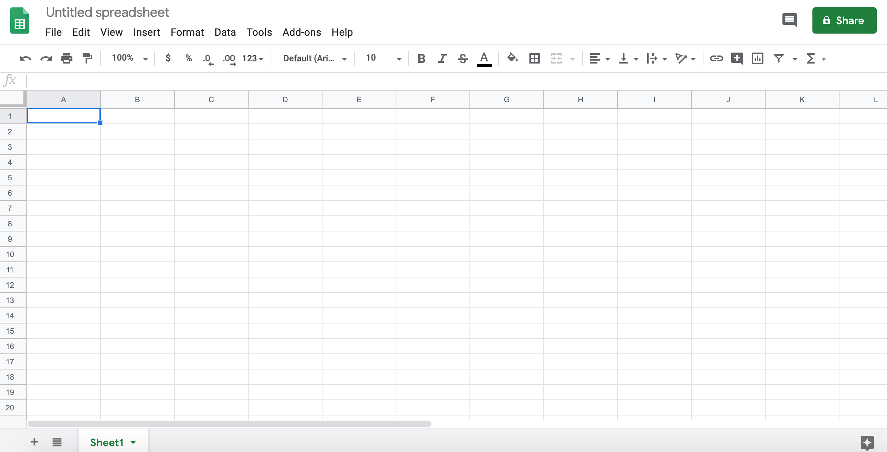

```{r, echo = FALSE, include=FALSE}
library(knitr)
opts_chunk$set(comment = "")
library(tidyverse)
```


# Google Sheets

---
```{r}

```

https://docs.google.com/spreadsheets

---

```{r}
knitr::include_graphics("gs_jenny_slide.png")
```

https://speakerdeck.com/jennybc/googlesheets-talk-at-user2015

## Reading data with the googlesheets package

<div style="font-size:30pt">

```{r, eval = FALSE}
install.packages("googlesheets")
library(googlesheets)
```

 
```{r, echo = FALSE}
library(googlesheets)
```

</div>


**need figure**

https://docs.google.com/spreadsheets/d/1WBrH655fxqKW1QqvD5hnqvvEWIvRzDJcKEgjjFeYxeM/edit#gid=0

**need publish figure**

---
<div style="font-size:30pt">
```{r}
sheets_url = "https://docs.google.com/spreadsheets/d/1WBrH655fxqKW1QqvD5hnqvvEWIvRzDJcKEgjjFeYxeM/edit?usp=sharing"

gsurl1 = gs_url(sheets_url)

dat = gs_read(gsurl1)
date_read = lubridate::today()
head(dat)
```
<div>


# What if I don't want it public?

<div style="font-size:30pt">
```{r, eval = FALSE}
library(googledrive)
drive_auth() # will ask you to log in
drive_get("1WBrH655fxqKW1QqvD5hnqvvEWIvRzDJcKEgjjFeYxeM")
library(googlesheets4)
out = read_sheet("https://docs.google.com/spreadsheets/d/1WBrH655fxqKW1QqvD5hnqvvEWIvRzDJcKEgjjFeYxeM/edit?usp=sharing")
```
<div>


https://docs.google.com/spreadsheets/d/1j9vbv8MrVV7EK15vyz-rnhjiXhRkmIFEHgdv1_p1cCc/edit?usp=sharing


```{r, eval = FALSE}
library(googlesheets4)
# Only necessary on rstudio.cloud
options(httr_oob_default=TRUE)
# Will ask you to log in
out = read_sheet("https://docs.google.com/spreadsheets/d/1WBrH655fxqKW1QqvD5hnqvvEWIvRzDJcKEgjjFeYxeM/edit?usp=sharing")


gs_auth()
gsurl1 = gs_url(sheets_url)
dat = gs_read(gsurl1)
sheets_url = "https://docs.google.com/spreadsheets/d/1j9vbv8MrVV7EK15vyz-rnhjiXhRkmIFEHgdv1_p1cCc/edit?usp=sharing"
```

Google Sheets
https://bit.ly/1Cgzjxb

JSON

https://en.wikipedia.org/wiki/JSON

Why JSON matters
https://developer.github.com/v3/search/

github_url = "https://api.github.com/users/jtleek/repos"

#install.packages("jsonlite")
library(jsonlite)
jsonData <- fromJSON(github_url)
date_read = date()
date_read


Data frame structure from JSON
dim(jsonData)
jsonData$name
#One of the columns is a data frame!
table(sapply(jsonData,class))
dim(jsonData$owner)
names(jsonData$owner)


JSON Lab
https://bit.ly/2JNLUil

Web Scraping

This is data
http://bowtie-bio.sourceforge.net/recount/ 

View the source

What the computer sees

Ways to see the source
# Chrome:
 # 1. right click on page
 # 2. select "view source"
# Firefox:
 # 1. right click on page
 # 2. select "view source"
# Microsoft Edge:
# 1. right click on page
# 2. select "view source"

# Safari
 # 1. click on "Safari"
 # 2. select "Preferences"
 # 3. go to "Advanced"
 # 4. check "Show Develop menu in menu bar"
 # 5. click on "Develop"
 # 6. select "show page source"
 # 7. alternatively to 5./6., right click on page and select "view source"

https://github.com/simonmunzert/rscraping-jsm-2016/blob/c04fd91fec711df65c838e07723125155a7f2cda/02-scraping-with-rvest.r

Inspect element

Copy XPath

rvest package
recount_url = "http://bowtie-bio.sourceforge.net/recount/"
# install.packages("rvest")
library(rvest)
htmlfile = read_html(recount_url)

nds = html_nodes(htmlfile,                
xpath='//*[@id="recounttab"]/table')
dat = html_table(nds)
dat = as.data.frame(dat)
head(dat)


http://motherboard.vice.com/read/70000-okcupid-users-just-had-their-data-published

https://www.theguardian.com/science/2012/may/23/text-mining-research-tool-forbidden

APIs

https://developers.facebook.com/
Application Programming Interfaces

http://www.ncbi.nlm.nih.gov/books/NBK25501/
In biology too!

Step 0: Did someone do this already
https://ropensci.org/

Do it yourself

Read the docs
https://developer.github.com/v3/

Read the docs

Read the docs

A dissected example
https://api.github.com/search/repositories?q=created:2014-08-13+language:r+-user:cran&type

The base URL
https://api.github.com/search/repositories?q=created:2014-08-13+language:r+-user:cran&type

Search repositories
https://api.github.com/search/repositories?q=created:2014-08-13+language:r+-user:cran&type

Create a query
https://api.github.com/search/repositories?q=created:2014-08-13+language:r+-user:cran&type

Date repo was created
https://api.github.com/search/repositories?q=created:2014-08-13+language:r+-user:cran&type

Language repo is in
https://api.github.com/search/repositories?q=created:2014-08-13+language:r+-user:cran&type

Ignore repos from “cran”
https://api.github.com/search/repositories?q=created:2014-08-13+language:r+-user:cran&type

#install.packages("httr")
library(httr)

query_url = "https://api.github.com/search/repositories?q=created:2014-08-13+language:r+-user:cran"

req = GET(query_url)
names(content(req))

Not all APIs are “open”
https://apps.twitter.com/

myapp = oauth_app("twitter",
                   key="yourConsumerKeyHere",secret="yourConsumerSecretHere")
sig = sign_oauth1.0(myapp,
                     token = "yourTokenHere",
                      token_secret = "yourTokenSecretHere")
homeTL = GET("https://api.twitter.com/1.1/statuses/home_timeline.json", sig)

But you can get cool data
json1 = content(homeTL)
json2 = jsonlite::fromJSON(toJSON(json1))
json2[1,1:4]

                    created_at           id             id_str
1 Mon Jan 13 05:18:04 +0000 2014 4.225984e+17 422598398940684288
                                                                                                                                         text
1 Now that P. Norvig's regex golf IPython notebook hit Slashdot, let's see if our traffic spike tops the previous one: http://t.co/Vc6JhZXOo8

Web + APIs lab
https://bit.ly/2JIwlIt

