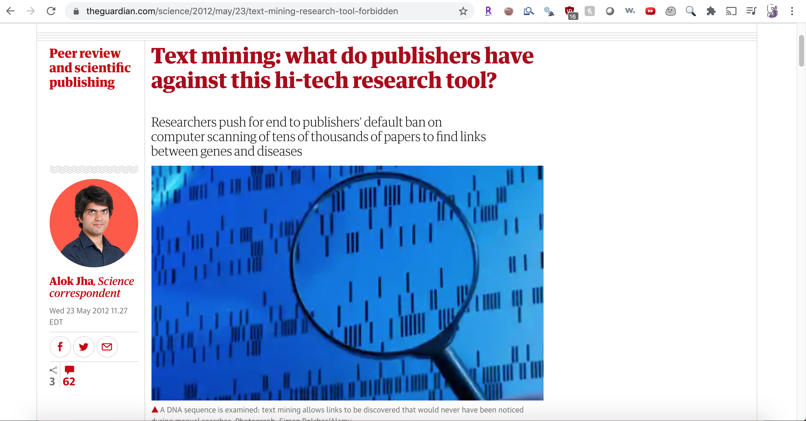
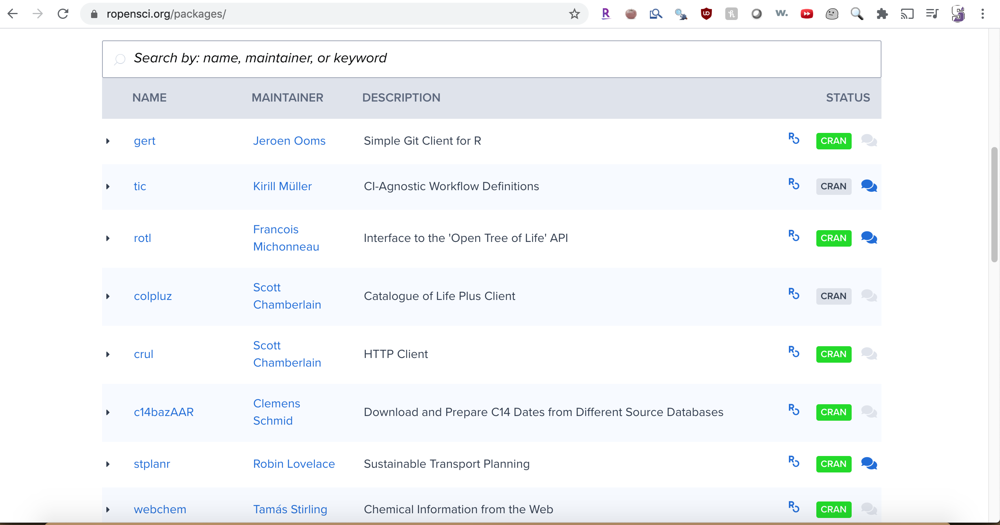

```{r, echo = FALSE, include=FALSE, purl=FALSE}
library(knitr)
opts_chunk$set(comment = "")
```

```{r, include=FALSE}
library(tidyverse)
library(rvest)
library(jsonlite)
```


# Google Sheets

---

```{r, out.width="100%", echo = FALSE, purl=FALSE}
knitr::include_graphics("googlesheets.png")
```

https://docs.google.com/spreadsheets

---

https://speakerdeck.com/jennybc/googlesheets-talk-at-user2015

```{r, out.width="70%", echo = FALSE, purl=FALSE}
knitr::include_graphics("gs_jenny_slide.png")
```


## Reading data with the googlesheets package

<div style="font-size:30pt">

```{r, eval = FALSE}
install.packages("googlesheets")
library(googlesheets)
```

 
```{r, echo = FALSE, purl = FALSE}
library(googlesheets)
```

</div>

---

```{r, out.width="100%", echo = FALSE, purl=FALSE}
knitr::include_graphics("googlesheet.png")
```

https://docs.google.com/spreadsheets/d/1WBrH655fxqKW1QqvD5hnqvvEWIvRzDJcKEgjjFeYxeM/edit#gid=0

---

```{r, out.width="100%", echo = FALSE, purl=FALSE}
knitr::include_graphics("googlesheet_publish.png")
```

----

<div style="font-size:20pt">
```{r, message = FALSE}
sheets_url = paste0("https://docs.google.com/spreadsheets/d/",
                    "1WBrH655fxqKW1QqvD5hnqvvEWIvRzDJcKEgjjFeYxeM")

gsurl1 = gs_url(sheets_url)

dat = gs_read(gsurl1)
date_read = lubridate::today()
head(dat)
```
<div>

# Googlesheets4 - API v4 Google Sheets Package

## What if I don't want it public?

```{r, eval = FALSE}
library(googlesheets4)
# May be necessary on rstudio.cloud
options(httr_oob_default=TRUE)
# Will ask you to log in
out = read_sheet(sheets_url)
```

## Can also save and load a token

```{r, message = FALSE}
token = readr::read_rds("googledrive_token.rds")
library(googledrive)
drive_auth(token = token) # could also use googlesheets4::gs4_auth
library(googlesheets4)
out = read_sheet(sheets_url)
head(out)
```


# Google Sheets<br> https://SISBIB.github.io/Module1/labs/google-sheets-lab.Rmd

# JSON: JavaScript Object Notation<br>Lists of stuff

---

```{r, out.width="80%", echo = FALSE, purl=FALSE}

```
https://en.wikipedia.org/wiki/JSON

## Why JSON matters

```{r, out.width="80%", echo = FALSE, purl=FALSE}
knitr::include_graphics("github_json.png")
```

https://docs.github.com/en/rest/reference/search

---


```{r}
#install.packages("jsonlite")
library(jsonlite)
jsonData <- fromJSON("https://api.github.com/users/jtleek/repos")
head(jsonData)
```


## Data frame structure from JSON

```{r}
dim(jsonData)
head(jsonData$name)
table(sapply(jsonData,class)) #Some of the columns is a data frame!
dim(jsonData$owner); names(jsonData$owner)
```


# JSON Lab<br> https://SISBIB.github.io/Module1/labs/json-lab.Rmd

# Web Scraping

## This is data

http://bowtie-bio.sourceforge.net/recount/ 
```{r, out.width="100%", echo = FALSE, purl=FALSE}
knitr::include_graphics("recount.png")
```


## View the source

```{r, out.width="100%", echo = FALSE, purl=FALSE}
knitr::include_graphics("recount_view.png")
```

## What the computer sees

```{r, out.width="100%", echo = FALSE, purl=FALSE}
knitr::include_graphics("recount_source.png")
```

## Ways to see the source

<div class="left-half">
Chrome:

1. right click on page
2. select "view source"

Firefox:

1. right click on page
2. select "view source"
Microsoft Edge:

1. right click on page
2. select "view source"
</div>

<div class="right-half">

Safari

1. click on "Safari"
2. select "Preferences"
3. go to "Advanced"
4. check "Show Develop menu in menu bar"
5. click on "Develop"
6. select "show page source"
7. alternatively to 5./6., right click on page and select "view source"
</div>

https://github.com/simonmunzert/rscraping-jsm-2016/blob/c04fd91fec711df65c838e07723125155a7f2cda/02-scraping-with-rvest.r

## Inspect element

```{r, out.width="100%", echo = FALSE, purl=FALSE}
knitr::include_graphics("recount_inpsect.png")
```

## Copy XPath

```{r, out.width="100%", echo = FALSE, purl=FALSE}
knitr::include_graphics("recount_xpath.png")
```

## rvest package
```{r}
recount_url = "http://bowtie-bio.sourceforge.net/recount/"
# install.packages("rvest")
library(rvest)
htmlfile = read_html(recount_url)

nds = html_nodes(htmlfile,                
xpath='//*[@id="recounttab"]/table')
dat = html_table(nds)
dat = as.data.frame(dat)
head(dat)
```

## Little cleanup

```{r}
colnames(dat) = as.character(dat[1,])
dat = dat[-1,]
head(dat)
```


----

http://motherboard.vice.com/read/70000-okcupid-users-just-had-their-data-published
```{r, out.width="100%", echo = FALSE, purl=FALSE}
knitr::include_graphics("okcupid.png")
```

----
https://www.theguardian.com/science/2012/may/23/text-mining-research-tool-forbidden
```{r, out.width="100%", echo = FALSE, purl=FALSE}

```

# APIs

## Application Programming Interfaces
https://developers.facebook.com/
```{r, out.width="100%", echo = FALSE, purl=FALSE}
knitr::include_graphics("facebook_dev.png")
```

## In biology too!
http://www.ncbi.nlm.nih.gov/books/NBK25501/

```{r, out.width="100%", echo = FALSE, purl=FALSE}
knitr::include_graphics("nih_api.png")
```

## Step 0: Did someone do this already
https://ropensci.org/packages/

```{r, out.width="100%", echo = FALSE, purl=FALSE}

```

## Do it yourself: read the Docs

https://docs.github.com/en/rest
```{r, out.width="100%", echo = FALSE, purl=FALSE}
knitr::include_graphics("github_rest.png")
```


## Read the docs
https://docs.github.com/en/rest/reference/repos

```{r, out.width="100%", echo = FALSE, purl=FALSE}
knitr::include_graphics("github_repo.png")
```

## Read the docs
https://docs.github.com/en/rest/reference/rate-limit

```{r, out.width="100%", echo = FALSE, purl=FALSE}
knitr::include_graphics("github_ratelimit.png")
```

## Read the docs

```{r, out.width="100%", echo = FALSE, purl=FALSE}
knitr::include_graphics("github_jquery.png")
```

## A dissected example

<div style="font-size:30pt">
https://api.github.com/search/repositories?q=created:2014-08-13+language:r+-user:cran
</div>

## The base URL
<div style="font-size:30pt">
**https://api.github.com/**search/repositories?q=created:2014-08-13+language:r+-user:cran
</div>

## The Path: Search repositories
<div style="font-size:30pt">
https://api.github.com/**search/repositories**?q=created:2014-08-13+language:r+-user:cran
</div>

## Create a query - pass the `q` parameter
<div style="font-size:30pt">
https://api.github.com/search/repositories**?q**=created:2014-08-13+language:r+-user:cran
</div>

## Date repo was created
<div style="font-size:30pt">
https://api.github.com/search/repositories?q=**created:2014-08-13**+language:r+-user:cran
</div>

## Language repo is in
<div style="font-size:30pt">
https://api.github.com/search/repositories?q=created:2014-08-13+**language:r**+-user:cran
</div>

## Ignore repos from "cran"
<div style="font-size:30pt">
https://api.github.com/search/repositories?q=created:2014-08-13+language:r+**-user:cran**
</div>

----
```{r}
#install.packages("httr")
library(httr)

query_url = paste0("https://api.github.com/", "search/repositories", 
                   "?q=created:2014-08-13", "+language:r", "+-user:cran")

req = GET(query_url)
names(content(req))
```

## Not all APIs are "open"

https://apps.twitter.com/

```{r, out.width="100%", echo = FALSE, purl=FALSE}
knitr::include_graphics("twitter.png")
```

---

(see also `twitteR` package)

```{r, eval = FALSE}
myapp = oauth_app("twitter",
                   key="yourConsumerKeyHere",secret="yourConsumerSecretHere")
sig = sign_oauth1.0(myapp,
                     token = "yourTokenHere",
                      token_secret = "yourTokenSecretHere")
homeTL = GET("https://api.twitter.com/1.1/statuses/home_timeline.json", sig)

# But you can get cool data
json1 = content(homeTL)
json2 = jsonlite::fromJSON(toJSON(json1))
json2[1,1:4]
```

```{r, eval = FALSE}
                    created_at           id             id_str
1 Mon Jan 13 05:18:04 +0000 2014 4.225984e+17 422598398940684288
                                                                                                                                         text
1 Now that P. Norvig's regex golf IPython notebook hit Slashdot, let's see if our traffic spike tops the previous one: http://t.co/Vc6JhZXOo8
```

