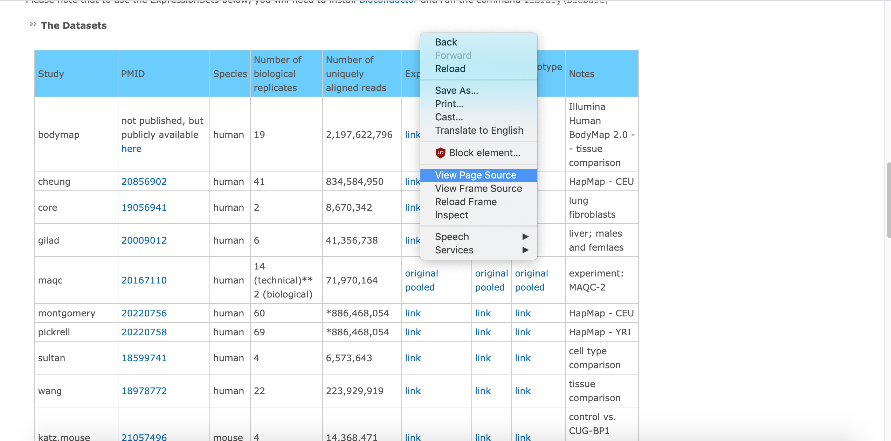

```{r, echo = FALSE, include=FALSE, purl=FALSE}
library(knitr)
opts_chunk$set(comment = "")
```

```{r, include=FALSE}
library(tidyverse)
library(rvest)
library(jsonlite)
```

# Google Sheets

---

```{r, out.width="100%", echo = FALSE, purl=FALSE}

```

https://docs.google.com/spreadsheets/d/1U6Cf_qEOhiR9AZqTqS3mbMF3zt2db48ZP5v3rkrAEJY/edit#gid=780868077

## Reading data with the googlesheets4 package

First, set up Google credentials

```{r}
library(googlesheets4)
```
```{r eval=FALSE}
# Prompts a browser pop-up
gs4_auth()
```
```{r}
# Once set up, you can automate this process by passing your email
gs4_auth(email = "avamariehoffman@gmail.com")
```

## Reading data with the googlesheets4 package

You can also supply an authorization token directly, but make sure to add any files to your .gitignore!

```{r eval = FALSE}
library(googledrive)
drive_auth(email= "<email>",
           token = readRDS("google-sheets-token.rds")) # Saved in a file
```

## Reading data with the googlesheets4 package

Read in using `googlesheets4::read_sheet`

```{r}
sheet_url = paste0("https://docs.google.com/spreadsheets/d/1U6Cf_qEOhiR9",
                   "AZqTqS3mbMF3zt2db48ZP5v3rkrAEJY/edit#gid=780868077")
sheet_dat_1 = read_sheet(sheet_url)
head(sheet_dat_1)
```

## Reading data with the googlesheets4 package

Specify the sheet name if necessary:

```{r}
sheet_url = paste0("https://docs.google.com/spreadsheets/d/1U6Cf_qEOhiR9",
                   "AZqTqS3mbMF3zt2db48ZP5v3rkrAEJY/edit#gid=780868077")
sheet_dat_oceania = read_sheet(sheet_url, sheet = "Oceania")
head(sheet_dat_oceania)
```

## Reading data with the googlesheets4 package

Alternatively, list out the sheet names using `sheet_names()`.

```{r}
sheet_names(sheet_url)
```

## Reading data with the googlesheets4 package

Iterate through the sheet names:

```{r}
gapminder_sheets = sheet_names(sheet_url)

data_list = list()
for(g_sheet in gapminder_sheets){
  data_list[[g_sheet]] = read_sheet(sheet_url, sheet = g_sheet)
}
str(data_list)
```

## Reading data with the googlesheets4 package

Iterate through the sheet names:

```{r}
str(data_list)
```

## Writing data with the googlesheets4 package

```{r}
sheet_dat_oceania = sheet_dat_oceania %>%
  mutate(lifeExp_days = lifeExp * 365)
sheet_out = gs4_create("Oceania-days", 
                       sheets = list(Oceania_days = sheet_dat_oceania))
```
```{r eval = FALSE}
# Opens a browser window
gs4_browse(sheet_out)
```

## Append data with the googlesheets4 package

```{r}
sheet_append(sheet_out, data = sheet_dat_oceania, sheet = "Oceania_days")
```

## JHU Tidyverse Book

https://jhudatascience.org/tidyversecourse/get-data.html#google-sheets

# googlesheets Lab<br> http://sisbid.github.io/Data-Wrangling/labs/advanced-io-lab.Rmd

# JSON: JavaScript Object Notation<br>Lists of stuff

---

```{r, out.width="80%", echo = FALSE, purl=FALSE}
knitr::include_graphics("wiki_json.png")
```

https://en.wikipedia.org/wiki/JSON

## Why JSON matters

```{r, out.width="80%", echo = FALSE, purl=FALSE}
knitr::include_graphics("github_json.png")
```

https://docs.github.com/en/rest/reference/search

---

```{r}
#install.packages("jsonlite")
library(jsonlite)
jsonData <- fromJSON(paste0("https://raw.githubusercontent.com/Biuni",
                            "/PokemonGO-Pokedex/master/pokedex.json"))
head(jsonData)
```

## Data frame structure from JSON

```{r}
dim(jsonData$pokemon)
class(jsonData$pokemon$type) # Can be lists
jsonData$pokemon$type
```

## Data frame structure from JSON

```{r}
class(jsonData$pokemon$next_evolution[[1]]) # Or lists of data.frames!
jsonData$pokemon$next_evolution
```

# JSON Lab<br> http://sisbid.github.io/Data-Wrangling/labs/advanced-io-lab.Rmd

# Web Scraping

## This is data

http://bowtie-bio.sourceforge.net/recount/ 
```{r, out.width="100%", echo = FALSE, purl=FALSE}

```

## View the source

```{r, out.width="100%", echo = FALSE, purl=FALSE}

```

## What the computer sees

```{r, out.width="100%", echo = FALSE, purl=FALSE}

```

## Ways to see the source

<div class="left-half">
<div style="font-size:15pt">
Chrome:

1. right click on page
2. select "View Page Source"

Firefox:

1. right click on page
2. select "View Page Source"

Microsoft Edge:

1. right click on page
2. select "view source"
</div>
</div>

<div class="right-half">
<div style="font-size:15pt">
Safari

1. click on "Safari"
2. select "Preferences"
3. go to "Advanced"
4. check "Show Develop menu in menu bar"
5. right click on page
6. select "View Page Source"
</div>
</div>

https://github.com/simonmunzert/rscraping-jsm-2016/blob/c04fd91fec711df65c838e07723125155a7f2cda/02-scraping-with-rvest.r

## Inspect element

```{r, out.width="100%", echo = FALSE, purl=FALSE}

```

## Copy XPath

```{r, out.width="100%", echo = FALSE, purl=FALSE}

```

## Use SelectorGadget

https://rvest.tidyverse.org/articles/selectorgadget.html

## rvest package
```{r}
recount_url = "http://bowtie-bio.sourceforge.net/recount/"
# install.packages("rvest")
library(rvest)
htmlfile = read_html(recount_url)

nds = html_nodes(htmlfile, xpath = '//*[@id="recounttab"]/table')
dat = html_table(nds)
dat = as.data.frame(dat)
head(dat)
```

## Little cleanup

```{r}
colnames(dat) = as.character(dat[1,])
dat = dat[-1,]
head(dat)
```

## Ethics and Web Scraping

https://slate.com/culture/2020/04/whitney-museum-new-york-apartment-exhibit-creators-interview.html
```{r, out.width="75%", echo = FALSE, purl=FALSE}

```

## Ethics and Web Scraping

https://doi.org/10.1016/j.dib.2020.106178
```{r, out.width="50%", echo = FALSE, purl=FALSE}

```

## Ethics and Web Scraping

https://techcrunch.com/2017/04/28/someone-scraped-40000-tinder-selfies-to-make-a-facial-dataset-for-ai-experiments/
```{r, out.width="50%", echo = FALSE, purl=FALSE}

```

## Ethics and Web Scraping

https://on.wsj.com/3hzeu9i
```{r, out.width="75%", echo = FALSE, purl=FALSE}

```

# APIs

## Application Programming Interfaces
https://developers.facebook.com/
```{r, out.width="100%", echo = FALSE, purl=FALSE}

```

## In biology too!
http://www.ncbi.nlm.nih.gov/books/NBK25501/
https://www.ncbi.nlm.nih.gov/home/develop/api/

```{r, out.width="100%", echo = FALSE, purl=FALSE}

```

## Step 0: Did someone do this already
https://ropensci.org/packages/

```{r, out.width="50%", echo = FALSE, purl=FALSE}

```

## Do it yourself: read the Docs

https://docs.github.com/en/rest
```{r, out.width="100%", echo = FALSE, purl=FALSE}
knitr::include_graphics("media/AdvancedIO_github_rest.png")
```

## Read the docs
https://docs.github.com/en/rest/reference/repos

```{r, out.width="100%", echo = FALSE, purl=FALSE}
knitr::include_graphics("github_repo.png")
```

## Read the docs
https://docs.github.com/en/rest/reference/rate-limit

```{r, out.width="100%", echo = FALSE, purl=FALSE}
knitr::include_graphics("github_ratelimit.png")
```

## Read the docs

```{r, out.width="100%", echo = FALSE, purl=FALSE}
knitr::include_graphics("github_jquery.png")
```

## A dissected example

<div style="font-size:30pt">
https://api.github.com/search/repositories?q=created:2014-08-13+language:r+-user:cran
</div>

## The base URL
<div style="font-size:30pt">
**https://api.github.com/**search/repositories?q=created:2014-08-13+language:r+-user:cran
</div>

## The Path: Search repositories
<div style="font-size:30pt">
https://api.github.com/**search/repositories**?q=created:2014-08-13+language:r+-user:cran
</div>

## Create a query - pass the `q` parameter
<div style="font-size:30pt">
https://api.github.com/search/repositories**?q**=created:2014-08-13+language:r+-user:cran
</div>

## Date repo was created
<div style="font-size:30pt">
https://api.github.com/search/repositories?q=**created:2014-08-13**+language:r+-user:cran
</div>

## Language repo is in
<div style="font-size:30pt">
https://api.github.com/search/repositories?q=created:2014-08-13+**language:r**+-user:cran
</div>

## Ignore repos from "cran"
<div style="font-size:30pt">
https://api.github.com/search/repositories?q=created:2014-08-13+language:r+**-user:cran**
</div>

----
```{r}
#install.packages("httr")
library(httr)

query_url = paste0("https://api.github.com/", "search/repositories", 
                   "?q=created:2014-08-13", "+language:r", "+-user:cran")

req = GET(query_url)
names(content(req))
```

## Not all APIs are "open"

https://apps.twitter.com/

```{r, out.width="100%", echo = FALSE, purl=FALSE}
knitr::include_graphics("twitter.png")
```

---

(see also `twitteR` package)

```{r, eval = FALSE}
myapp = oauth_app("twitter",
                   key="yourConsumerKeyHere",secret="yourConsumerSecretHere")
sig = sign_oauth1.0(myapp,
                     token = "yourTokenHere",
                      token_secret = "yourTokenSecretHere")
homeTL = GET("https://api.twitter.com/1.1/statuses/home_timeline.json", sig)

# But you can get cool data
json1 = content(homeTL)
json2 = jsonlite::fromJSON(toJSON(json1))
json2[1,1:4]
```

```{r, eval = FALSE}
                    created_at           id             id_str
1 Mon Jan 13 05:18:04 +0000 2014 4.225984e+17 422598398940684288
                                                                                                                                         text
1 Now that P. Norvig's regex golf IPython notebook hit Slashdot, let's see if our traffic spike tops the previous one: http://t.co/Vc6JhZXOo8
```

