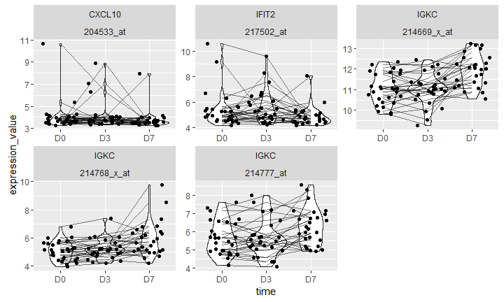

# SISBD: Introduction to Bioconductor
Raphael Gottardo  
 `r Sys.Date()`  

## Setting up some options

Let's first turn on the cache for increased performance and improved styling

```r
# Set some global knitr options
suppressMessages(library("knitr"))
opts_chunk$set(cache = FALSE, messages = FALSE)
```

## R in the NY Times

"Despite" being free and open-source, R is widely used by data analysts inside corporations and academia.

See [NY Times](http://www.nytimes.com/2009/01/07/technology/business-computing/07program.html?pagewanted=all&_r=0) article


## R in Nature 

<iframe src="http://www.nature.com/news/programming-tools-adventures-with-r-1.16609?WT.ec_id=NATURE-20141225"></iframe>

## R is a really mature project

Some of the best R functionalities **ARE NOT** in R-base but come from add-on packages: knitr, ggplot2, reshape2, Rcpp, data.table, etc.

Some of these packages are available on the following repositories:

- [CRAN](http://cran.r-project.org)
- [Bioconductor](http://bioconductor.org)
- [GitHub](http://github.com)
- [Ropensci](https://ropensci.org)

**Note:** Show how to update the list of repositories to install packages (`setRepositories`). Also talk about biocLite.


## The Bioconductor project

- [Bioconductor](http://www.bioconductor.org) is an open source, open development software project to provide tools for the analysis and comprehension of high-throughput genomic data. It is based primarily on the R programming language.

- Most Bioconductor components are distributed as R packages. The functional scope of Bioconductor packages includes the analysis of DNA microarray, sequence, flow, SNP, and other data.

## Project Goals

The broad goals of the Bioconductor project are:

- To provide widespread access to a broad range of powerful statistical and graphical methods for the analysis of genomic data.
- To facilitate the inclusion of biological metadata in the analysis of genomic data, e.g. literature data from PubMed, annotation data from Entrez genes.
- To provide a common software platform that enables the rapid development and deployment of extensible, scalable, and interoperable software.
- To further scientific understanding by producing high-quality documentation and reproducible research.
- To train researchers on computational and statistical methods for the analysis of genomic data.

## Quick overview of the website

- biocViews
- Support site
- Teaching material
- Installation

## Getting started


```r
# Note that this is not evaluated here, so you will have to do it before using this knitr doc
source("http://bioconductor.org/biocLite.R")
# Install all core packages and update all installed packages
biocLite()
```

You can also install specific packages


```r
# Note that this is not evaluated here, so you will have to do it before using this knitr doc
biocLite(c("GEOmetadb", "GEOquery", "limma", "affy"))
```

# Overview of SQL and data.table (external notes)

## The Gene Expression Omnibus (GEO)

The [Gene Expression Omnibus](http://www.ncbi.nlm.nih.gov/geo/) is an international public repository that archives and freely distributes microarray, next-generation sequencing, and other forms of high-throughput functional genomics data submitted by the research community.

The three main goals of GEO are to:

- Provide a robust, versatile database in which to efficiently store high-throughput functional genomic data
- Offer simple submission procedures and formats that support complete and well-annotated data deposits from the research community
- Provide user-friendly mechanisms that allow users to query, locate, review and download studies and gene expression profiles of interest

## Getting data from GEO

Before getting data from GEO, we need to see what data we want. For that we can use the `GEOmetadb` package. 


```r
suppressMessages(library(GEOmetadb))
```

Remember that packages in Bioconductor are well documented with a vignette that can be access as follows:


```r
vignette("GEOmetadb")
```
or if the package contains multiple vignettes or a vignette with a non-standard name


```r
browseVignettes(package = "GEOmetadb")
```

## Finding the right data in GEO

Zhu, Y., Davis, S., Stephens, R., Meltzer, P. S., & Chen, Y. (2008). GEOmetadb: powerful alternative search engine for the Gene Expression Omnibus. Bioinformatics (Oxford, England), 24(23), 2798–2800. doi:10.1093/bioinformatics/btn520

GEOmetadb uses a SQLite database to store all metadata associate with GEO.


```r
## This will download the entire database, so can be slow
if (!file.exists("GEOmetadb.sqlite"))
{
  # Download database only if it's not done already
  getSQLiteFile()
}
```

## Finding the right data in GEO


```r
geo_con <- dbConnect(SQLite(),'GEOmetadb.sqlite')
dbListTables(geo_con)
```

```
##  [1] "gds"               "gds_subset"        "geoConvert"       
##  [4] "geodb_column_desc" "gpl"               "gse"              
##  [7] "gse_gpl"           "gse_gsm"           "gsm"              
## [10] "metaInfo"          "sMatrix"
```


```r
dbListFields(geo_con, 'gse')
```

```
##  [1] "ID"                   "title"                "gse"                 
##  [4] "status"               "submission_date"      "last_update_date"    
##  [7] "pubmed_id"            "summary"              "type"                
## [10] "contributor"          "web_link"             "overall_design"      
## [13] "repeats"              "repeats_sample_list"  "variable"            
## [16] "variable_description" "contact"              "supplementary_file"
```

## Finding a study

The basic record types in GEO include Platforms (GPL), Samples (GSM), Series (GSE) and DataSets (GDS)


```r
dbGetQuery(geo_con, "SELECT gse.ID, gse.title, gse.gse FROM gse WHERE gse.pubmed_id='21743478';")
```

```
##      ID
## 1 26409
## 2 26410
## 3 26412
## 4 26413
## 5 26414
##                                                                                                          title
## 1                  Time Course of Young Adults Vaccinated with Influenza TIV Vaccine during 2007/08 Flu Season
## 2                 Time Course of Young Adults Vaccinated with Influenza LAIV Vaccine during 2008/09 Flu Season
## 3                  Time Course of Young Adults Vaccinated with Influenza TIV Vaccine during 2008/09 Flu Season
## 4 FACS-sorted cells from Young Adults Vaccinated with Influenza TIV or LAIV Vaccines during 2008/09 Flu Season
## 5                                              Systems biology of vaccination for seasonal influenza in humans
##        gse
## 1 GSE29614
## 2 GSE29615
## 3 GSE29617
## 4 GSE29618
## 5 GSE29619
```

## Finding a study

What samples were used?


```r
dbGetQuery(geo_con, "SELECT gse.gse, gsm.gsm, gsm.title FROM (gse JOIN gse_gsm ON gse.gse=gse_gsm.gse) j JOIN gsm ON j.gsm=gsm.gsm WHERE gse.pubmed_id='21743478' LIMIT 5;")
```

```
##    gse.gse   gsm.gsm                                     gsm.title
## 1 GSE29614 GSM733816 2007 TIV subject ID 12 at D0 post-vaccination
## 2 GSE29614 GSM733817 2007 TIV subject ID 12 at D3 post-vaccination
## 3 GSE29614 GSM733818 2007 TIV subject ID 12 at D7 post-vaccination
## 4 GSE29614 GSM733819 2007 TIV subject ID 16 at D0 post-vaccination
## 5 GSE29614 GSM733820 2007 TIV subject ID 16 at D3 post-vaccination
```
gse_gsm contains the gse number that is associated with the gsm number. 
j is the name of a table that is created by joining gse and ges_gsm. Then j is joined with table gsm. 

## Finding a study

What about raw data?


```r
res <- dbGetQuery(geo_con, "SELECT gsm.gsm, gsm.supplementary_file FROM (gse JOIN gse_gsm ON gse.gse=gse_gsm.gse) j JOIN gsm ON j.gsm=gsm.gsm WHERE gse.pubmed_id='21743478' LIMIT 5;")
head(res)
```

```
##     gsm.gsm
## 1 GSM733816
## 2 GSM733817
## 3 GSM733818
## 4 GSM733819
## 5 GSM733820
##                                                                                                                                                  gsm.supplementary_file
## 1 ftp://ftp.ncbi.nlm.nih.gov/geo/samples/GSM733nnn/GSM733816/suppl/GSM733816.CEL.gz;\tftp://ftp.ncbi.nlm.nih.gov/geo/samples/GSM733nnn/GSM733816/suppl/GSM733816.chp.gz
## 2 ftp://ftp.ncbi.nlm.nih.gov/geo/samples/GSM733nnn/GSM733817/suppl/GSM733817.CEL.gz;\tftp://ftp.ncbi.nlm.nih.gov/geo/samples/GSM733nnn/GSM733817/suppl/GSM733817.chp.gz
## 3 ftp://ftp.ncbi.nlm.nih.gov/geo/samples/GSM733nnn/GSM733818/suppl/GSM733818.CEL.gz;\tftp://ftp.ncbi.nlm.nih.gov/geo/samples/GSM733nnn/GSM733818/suppl/GSM733818.chp.gz
## 4 ftp://ftp.ncbi.nlm.nih.gov/geo/samples/GSM733nnn/GSM733819/suppl/GSM733819.CEL.gz;\tftp://ftp.ncbi.nlm.nih.gov/geo/samples/GSM733nnn/GSM733819/suppl/GSM733819.chp.gz
## 5 ftp://ftp.ncbi.nlm.nih.gov/geo/samples/GSM733nnn/GSM733820/suppl/GSM733820.CEL.gz;\tftp://ftp.ncbi.nlm.nih.gov/geo/samples/GSM733nnn/GSM733820/suppl/GSM733820.chp.gz
```
raw data is contained in the supplementary files, which are listed in the gsm file. 

## Finding specific data

To get list of manufacturers:

```r
suppressMessages(library(data.table))
manu <- data.table(dbGetQuery(geo_con, "SELECT manufacturer FROM gpl"))
manu[, .(n = .N), by = manufacturer][order(-n)]
```

```
##                                                                                                manufacturer
##    1:                                                                                                    NA
##    2:                                                                                  Agilent Technologies
##    3:                                                                                            Affymetrix
##    4:                                                                                             NimbleGen
##    5:                                                                                               Agilent
##   ---                                                                                                      
## 2102:                                                                     Functional Genomics Center Verona
## 2103:                                                                                             Brown Lab
## 2104:                                                                         Luminex IMAP/Golub laboratory
## 2105: Agriculture and Agri-Food Canada, Eastern Cereal and Oilseed Research Centre, Ottawa, Ontario, Canada
## 2106:                                                                                     Custom microarray
##          n
##    1: 3398
##    2: 1615
##    3: 1029
##    4:  967
##    5:  575
##   ---     
## 2102:    1
## 2103:    1
## 2104:    1
## 2105:    1
## 2106:    1
```

## Finding specific data

To get supplementary file names ending with cel.gz from only manufacturer Affymetrix

```r
res <- dbGetQuery(geo_con, "SELECT gpl.bioc_package, gsm.title, gsm.series_id, gsm.gpl, gsm.supplementary_file FROM gsm JOIN gpl ON gsm.gpl=gpl.gpl WHERE gpl.manufacturer='Affymetrix' AND gsm.supplementary_file like '%CEL.gz';")
head(res)
```

```
##   bioc_package               title series_id   gpl
## 1       hu6800          BM_CD34-1a    GSE500 GPL80
## 2       hu6800          BM_CD34-1b    GSE500 GPL80
## 3       hu6800           BM_CD34-2    GSE500 GPL80
## 4       hu6800        GPBMC_CD34-1    GSE500 GPL80
## 5       hu6800        GPBMC_CD34-2    GSE500 GPL80
## 6       rgu34a CNS-SC_Inj24h-3A-s2    GSE464 GPL85
##                                                            supplementary_file
## 1    ftp://ftp.ncbi.nlm.nih.gov/geo/samples/GSMnnn/GSM575/suppl/GSM575.cel.gz
## 2    ftp://ftp.ncbi.nlm.nih.gov/geo/samples/GSMnnn/GSM576/suppl/GSM576.cel.gz
## 3    ftp://ftp.ncbi.nlm.nih.gov/geo/samples/GSMnnn/GSM577/suppl/GSM577.cel.gz
## 4    ftp://ftp.ncbi.nlm.nih.gov/geo/samples/GSMnnn/GSM578/suppl/GSM578.cel.gz
## 5    ftp://ftp.ncbi.nlm.nih.gov/geo/samples/GSMnnn/GSM579/suppl/GSM579.cel.gz
## 6 ftp://ftp.ncbi.nlm.nih.gov/geo/samples/GSM1nnn/GSM1136/suppl/GSM1136.CEL.gz
```

## Finding specific data

From previous table:

- bioc_package = bioconductor package
- hu6800 = Affymetrix HuGeneFL Genome Array annotation data (chip hu6800) 
- rgu34a = Affymetrix Rat Genome U34 Set annotation data (chip rgu34a)
- title = data set title or study title

For example BM_CD34-1a = bone marrow flow-sorted CD34+ cells (>95% purity) and has GSM sample number GSM575. 

## Getting the data we want

We will first create a directory where we will download data:

```r
dir.create("data/geo", recursive = TRUE)
```

```
## Warning in dir.create("data/geo", recursive = TRUE): 'data/geo' already
## exists
```

Now we can download the data we want using our GSE ID and the GEOquery command, as follows,


```r
# Download the mapping information and processed data
# This returns a list of eSets
GSE29617_set <- getGEO("GSE29617", destdir = "data/geo/")[[1]]
```

```
## ftp://ftp.ncbi.nlm.nih.gov/geo/series/GSE29nnn/GSE29617/matrix/
## Found 1 file(s)
## GSE29617_series_matrix.txt.gz
## Using locally cached version: data/geo//GSE29617_series_matrix.txt.gz
## Using locally cached version of GPL13158 found here:
## data/geo//GPL13158.soft
```
which returns (a list of) an ExpressionSet (eSet).

## The eSet class

What is an `eSet`? An S4 class that tries to:
- Coordinate high through-put (e.g., gene expression) and phenotype data.
- Provide common data container for diverse Bioconductor packages.


```r
str(GSE29617_set, max.level = 2)
```

```
## Formal class 'ExpressionSet' [package "Biobase"] with 7 slots
##   ..@ experimentData   :Formal class 'MIAME' [package "Biobase"] with 13 slots
##   ..@ assayData        :<environment: 0x7fb6856958a0> 
##   ..@ phenoData        :Formal class 'AnnotatedDataFrame' [package "Biobase"] with 4 slots
##   ..@ featureData      :Formal class 'AnnotatedDataFrame' [package "Biobase"] with 4 slots
##   ..@ annotation       : chr "GPL13158"
##   ..@ protocolData     :Formal class 'AnnotatedDataFrame' [package "Biobase"] with 4 slots
##   ..@ .__classVersion__:Formal class 'Versions' [package "Biobase"] with 1 slot
```

`str()` is the command to get the internal structure of an R object. 
An eSet contains the necessary "parts" to summarize an experiment.

## Classes and methods

**Everything in R is an OBJECT.**

- A class is the definition of an object.
- A method is a function that performs specific calculations on objects of a
specific class. Generic functions are used to determine the class of its
arguments and select the appropriate method. A generic function is a
function with a collection of methods.
- See ?Classes and ?Methods for more information.

## Classes and methods


```r
data(iris)
class(iris)
```

```
## [1] "data.frame"
```

```r
summary(iris)
```

```
##   Sepal.Length    Sepal.Width     Petal.Length    Petal.Width   
##  Min.   :4.300   Min.   :2.000   Min.   :1.000   Min.   :0.100  
##  1st Qu.:5.100   1st Qu.:2.800   1st Qu.:1.600   1st Qu.:0.300  
##  Median :5.800   Median :3.000   Median :4.350   Median :1.300  
##  Mean   :5.843   Mean   :3.057   Mean   :3.758   Mean   :1.199  
##  3rd Qu.:6.400   3rd Qu.:3.300   3rd Qu.:5.100   3rd Qu.:1.800  
##  Max.   :7.900   Max.   :4.400   Max.   :6.900   Max.   :2.500  
##        Species  
##  setosa    :50  
##  versicolor:50  
##  virginica :50  
##                 
##                 
## 
```

## Classes and methods

There are two types of classes in R: S3 Classes (old style, informal) and S4 Classes - (new style, more rigorous and formal)


```r
# S3 class
head(methods(class = "data.frame"))
# S4 class
showMethods(classes  = "eSet")
```

## The eSet

You can get a sense of the defined methods for an `eSet` as follows:

```r
library(Biobase)
showMethods(classes = "eSet")
```
in particular, the following methods are rather convenient:

- assayData(obj); assayData(obj) `<-` value: access or assign assayData
- phenoData(obj); phenoData(obj) `<-` value: access or assign phenoData
- experimentData(obj); experimentData(obj) `<-` value: access or assign experimentData
- annotation(obj); annotation(obj) `<-` value: access or assign annotation

## The ExpressionSet subclass

Similar to the `eSet` class but tailored to gene expression, with an expression matrix that can be accessed with the `exprs` method.


```r
class(GSE29617_set)
```

```
## [1] "ExpressionSet"
## attr(,"package")
## [1] "Biobase"
```

```r
exprs(GSE29617_set)[1:2,1:3]
```

```
##              GSM733942 GSM733943 GSM733944
## 1007_PM_s_at   4.62965   4.46083   4.54702
## 1053_PM_at     4.41375   4.72417   4.48257
```

also provides additional methods such as `fData`.

## The ExpressionSet subclass

`ExpressionSet` objects are meant to facilitate the adoption of MIAME standard. MIAME = "Minimum Information about a Microarray experiment". Alvis Brazma et. al. (2001) Nature Genetics
Unfortrunately, not all contributors will upload all the information.

```r
# Information about preprocessing
# Nothing in here!
preproc(GSE29617_set)
```

```
## list()
```

## The ExpressionSet subclass


```r
# A data.frame with number of rows equal to the number of samples
pData(GSE29617_set)[1:2,1:2]
```

```
##                                                  title geo_accession
## GSM733942 2008 TIV subject ID 2 at D0 post-vaccination     GSM733942
## GSM733943 2008 TIV subject ID 2 at D7 post-vaccination     GSM733943
```

```r
# A data.frame with number of rows equal to the number of features/probes
fData(GSE29617_set)[1:2,1:2]
```

```
##                        ID GB_ACC
## 1007_PM_s_at 1007_PM_s_at U48705
## 1053_PM_at     1053_PM_at M87338
```

## The ExpressionSet subclass 

So the `ExpressionSet` objects facilitate the encapsulation of everything that's needed to summarize and analyze an experiment. Specific elements can be access with the `@` operator but many classes have convenient accessor methods.


```r
fData(GSE29617_set)[1:2, 1:2]
```

```
##                        ID GB_ACC
## 1007_PM_s_at 1007_PM_s_at U48705
## 1053_PM_at     1053_PM_at M87338
```

```r
# Note that S4 classes can be nested!
GSE29617_set@featureData@data[1:2, 1:2]
```

```
##                        ID GB_ACC
## 1007_PM_s_at 1007_PM_s_at U48705
## 1053_PM_at     1053_PM_at M87338
```

## What if you want the raw data?

GEO also provides access to raw data that can be downloaded with `GEOquery`.


```r
# Download all raw data. This should only be evaluated once
# Then the data would be stored locally in the data directory
# Make sure the directory exists
if (length(dir("data/geo/", pattern = "GSE29617")) == 0) {
  getGEOSuppFiles("GSE29617", makeDirectory = TRUE, baseDir = "./data/geo/")
  untar("./data/geo/GSE29617/GSE29617_RAW.tar", exdir = "./data/geo/GSE29617/", 
        tar = Sys.getenv("TAR"))
}
# untar downloaded data
```

## Starting from the raw data

Now that we have the Affymetrix raw data (CEL) files, we can apply some of the concepts we've discussed related to normalization and probe summary. We first need to load the appropriate package


```r
## In case we haven't downloaded it before.
biocLite("affy")
```


```r
library(affy)
```

then we use the following commands

```r
# Read the CEL file and creates and AffyBatch
GSE29617_affyBatch <- ReadAffy(celfile.path = "data/geo/GSE29617/")
# Normalize and summarize the data
GSE29617_set2 <- rma(GSE29617_affyBatch)
```

```
## 
```

```
## Background correcting
## Normalizing
## Calculating Expression
```

## Starting from the raw data

Let's check the results and compare to the expression matrix that was submitted to GEO

```r
exprs(GSE29617_set2)[1:2,1:2]
```

```
##              GSM733942.CEL.gz GSM733943.CEL.gz
## 1007_PM_s_at         4.629650         4.460843
## 1053_PM_at           4.413773         4.724213
```

The rows are the features (i.e., probes). Columns are the samples.

## What are those probes?


```r
# We first need to install our annotation package
library(BiocInstaller)
# Note that you don't have to use source anymore!
biocLite("hthgu133a.db")
```


```r
library(hthgu133a.db)
```

```
## Loading required package: AnnotationDbi
## Loading required package: stats4
## Loading required package: GenomeInfoDb
## Loading required package: S4Vectors
## Loading required package: IRanges
## Loading required package: org.Hs.eg.db
```

```r
probe_ids <- rownames(GSE29617_set2)
probe_data <- select(hthgu133a.db, keys = probe_ids, columns = "SYMBOL", keytype = "PROBEID")
probe_data[1,]
```

```
##        PROBEID SYMBOL
## 1 1007_PM_s_at   <NA>
```
This didn't work very well, did it?
The problem is that the probe IDs in hthgu133a.db have a different naming scheme than those in GSE29617_set2. This is fixed on the next slide.

## What are those probes?

Let's fix this: Replace _PM with <empty> for the probe id names in GSE29617_set2

```r
probe_ids <- gsub("_PM","", rownames(GSE29617_set2))
probe_data <- select(hthgu133a.db, keys = probe_ids, columns = "SYMBOL", keytype = "PROBEID")
probe_data[1, ]
```

```
##     PROBEID SYMBOL
## 1 1007_s_at   DDR1
```
What's the warning? Some probes match up with multiple genes, therefore those probe IDs will have more than one record.

## What are those probes?

This gives us too many rows, what do we do? Concatenate the gene names so that there will be one row per probe ID.


```r
library(data.table)
probe_data_dt <- data.table(probe_data)
probe_data_dt_unique <- probe_data_dt[,list(SYMBOL = paste(SYMBOL, collapse = ";")), by = "PROBEID"]
probe_data_dt_unique[SYMBOL %like% ";"]
```

```
##           PROBEID                                  SYMBOL
##    1:   1007_s_at                            DDR1;MIR4640
##    2:     1294_at                            UBA7;MIR5193
##    3:     1773_at                        FNTB;CHURC1-FNTB
##    4: 200003_s_at                           RPL28;MIR6805
##    5: 200012_x_at         RPL21;SNORD102;SNORA27;RPL21P28
##   ---                                                    
## 1263:  65133_i_at                      INO80B;INO80B-WBP1
## 1264:    65585_at FAM86C1;FAM86B1;FAM86FP;FAM86B2;FAM86DP
## 1265:    66053_at                 HNRNPUL2;HNRNPUL2-BSCL2
## 1266:    78495_at                        LOC155060;ZNF783
## 1267:    91617_at                           DGCR8;MIR1306
```

## Completing our ExpressionSet


```r
annotaded_probes <- data.frame(probe_data_dt_unique)
rownames(annotaded_probes) <- rownames(GSE29617_set2)
fData(GSE29617_set2) <- annotaded_probes
head(fData(GSE29617_set2))
```

```
##                PROBEID       SYMBOL
## 1007_PM_s_at 1007_s_at DDR1;MIR4640
## 1053_PM_at     1053_at         RFC2
## 117_PM_at       117_at        HSPA6
## 121_PM_at       121_at         PAX8
## 1255_PM_g_at 1255_g_at       GUCA1A
## 1294_PM_at     1294_at UBA7;MIR5193
```


## Cleaning our metadata


```r
### Sanitize data and metadata
sanitize_pdata <- function(pd){
keepCols <- c(
  "characteristics_ch1.1", "characteristics_ch1.2",
  "description", 
  "supplementary_file")
pd <- pd[, keepCols]
colnames(pd) <- c("ptid", "time", "description", "filename")
pd$ptid <- gsub(".*: ", "", pd$ptid)
pd$time <- gsub(".*: ", "", pd$time)
pd$time <- gsub("Day", "D", pd$time)
pd$description <- gsub("(-\\w*){2}$", "", pd$description)
pd$filename <- basename(as.character(pd$filename))
pd$filename <- gsub(".CEL.gz", "", pd$filename)
pd
}
```

## Setting the metadata


```r
pData(GSE29617_set2) <- sanitize_pdata(pData(GSE29617_set))
pData(GSE29617_set2)[1:2, 1:2]
```

```
##           ptid time
## GSM733942    2   D0
## GSM733943    2   D7
```

**Exercise:** Repeat this with a different accession number.


## EDA of expression data

Let's get our data ready


```r
fd <- data.table(fData(GSE29617_set2), keep.rownames = TRUE)
setnames(fd, "rn", "probe_name")
pd <- data.table(pData(GSE29617_set2))
ed <- data.table(t(exprs(GSE29617_set2)), keep.rownames = TRUE)
setnames(ed, "rn", "filename")
ed <- ed[,filename := gsub(".CEL.gz", "", filename)]
setkey(pd, filename)
setkey(ed, filename)
md <- ed[pd]
```

## Reshaping data


```r
library(reshape2)
md_long <- melt(md, variable.name = "probe_name", value.name = "expression_value")
```

```
## Warning in melt.data.table(md, variable.name = "probe_name", value.name
## = "expression_value"): To be consistent with reshape2's melt, id.vars and
## measure.vars are internally guessed when both are 'NULL'. All non-numeric/
## integer/logical type columns are conisdered id.vars, which in this case are
## columns 'filename, ptid, time, description'. Consider providing at least
## one of 'id' or 'measure' vars in future.
```

```r
# Add gene variance
md_long <- md_long[, sd_probe := sd(expression_value), by = probe_name]
```

## Filter and join


```r
setkey(md_long, probe_name)
setkey(fd, probe_name)
md_long_short <- fd[md_long[sd_probe > .5] , nomatch = 0]
```


## EDA of expression data


```r
library(ggplot2)
ggplot(md_long_short[SYMBOL %in% c("IGJ", "IGKC", "CXCL10", "IFIT2")], aes(x = time, y = expression_value)) + geom_violin() + geom_jitter() + geom_line(aes(group = ptid), alpha = .5) + facet_wrap( ~SYMBOL + PROBEID, scales = "free")
```

 

**Exercise:** Repeat this with different gene names and geometries

