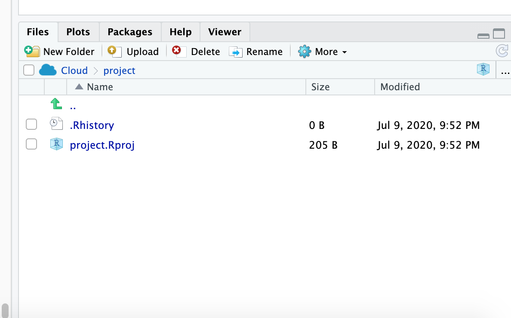
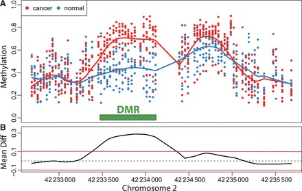

```{r, include = FALSE}
library(knitr)
library(readr)
# suppressPackageStartupMessages(library(dplyr))
knitr::opts_chunk$set(comment = "")
```

## Explaining output on slides

In slides, a command (we'll also call them code or a code chunk) will look like this
```{r code}
print("I'm code")
```

And then directly after it, will be the output of the code.  
So `print("I'm code")` is the code chunk and [1] "I'm code" is the output. 

These slides were made in R using `knitr` and `R Markdown` which is covered in later today when we discuss reproducible research.


## Data Input

* 'Reading in' data is the first step of any real project/analysis
* R can read almost any file format, especially via add-on packages
* We are going to focus on simple delimited files first
    * tab delimited (e.g. '.txt')
    * comma separated (e.g. '.csv')
    * Microsoft excel (e.g. '.xlsx')

## Data Input

UFO Sightings via Kaggle.com: "Reports of unidentified flying object reports in the last century". 

"There are two versions of this dataset: scrubbed and complete. The complete data includes entries where the location of the sighting was not found or blank (0.8146%) or have an erroneous or blank time (8.0237%). Since the reports date back to the 20th century, some older data might be obscured. Data contains city, state, time, description, and duration of each sighting."

https://www.kaggle.com/NUFORC/ufo-sightings

## Data Input
* Download data from http://sisbid.github.io/Module1/data/ufo/ufo_data_complete.csv.gz
* Upload the data to RStudio Cloud 
```{r, echo = FALSE, out.width="100%"}

```
## Data Input

Easy way: R Studio features some nice "drop down" support, where you can run some tasks by selecting them from the toolbar.

For example, you can easily import text datasets using the "Tools --> Import Dataset --> From Text (readr)" command. Selecting this will bring up a new screen that lets you specify the formatting of your text file. 

After importing a dataset, you get the corresponding R commands that you can enter in the console if you want to re-import data.


## Commenting in Scripts

Commenting in code is super important. You should be able to go back to your code years after writing it and figure out exactly what the script is doing. Commenting helps you do this. This happens to me often...

## Commenting in Scripts


## Commenting in Scripts



## Commenting in Scripts


## Commenting in Scripts

Add a comment header to your script from today:`#` is the comment symbol

```{r}
#################
# Title: Demo R Script
# Author: Andrew Jaffe
# Date: 7/13/2020
# Purpose: Demonstrate comments in R
###################
 
# nothing to its right is evaluated

# this # is still a comment
### you can use many #'s as you want

# sometimes you have a really long comment,
#    like explaining what you are doing 
#    for a step in analysis. 
# Take it to another line
```


## R variables 

* You can create variables from within the R environment and from files on your computer
* R uses "=" or "<-" to assign values to a variable name
* Variable names are case-sensitive, i.e. X and x are different

```{r assign}
x = 2 # Same as: x <- 2
x
x * 4
x + 2
```

## Help

For any function, you can write `?FUNCTION_NAME`, or `help("FUNCTION_NAME")` to look at the help file:

```{r, eval = FALSE}
?dir
help("dir")
```


## Data Input

Initially-harder-but-gets-way-easier method: Utilizing functions in the `readr` package called `read_delim()` and `read_csv()` with code.

## Data Input

So what is going on "behind the scenes"?

`read_delim()`: Read a delimited file into a data frame.


```{r, echo = FALSE}
args(readr::read_delim)
```

```   
# for example: read_delim("file.txt",delim="\t")
```


## Data Input

* The filename is the path to your file, in quotes
* The function will look in your "working directory" if no absolute file path is given
* Note that the filename can also be a path to a file on a website (e.g. 'www.someurl.com/table1.txt')


## Data Input

There is another convenient function for reading in CSV files, where the delimiter is assumed to be a comma: 

```{r readCSV}
read_csv
```

## Data Input

* Here would be reading in the data from the command line, specifying the file path:

```{r readCSV2}
ufo = read_csv("../data/ufo/ufo_data_complete.csv")
```

The data is now successfully read into your R workspace, just like from using the dropdown menu.

## Data Input

The `read_delim()` and related functions returns a "tibble" is a `data.frame` with special printing, which is the primary data format for most data cleaning and analyses. 

```{r viewInput, message=FALSE}
head(ufo)
class(ufo)
```

## Data Input

```{r, viewTibble}
ufo
```


## Data Input

There are also data importing functions provided in base R (rather than the `readr` package), like `read.delim` and `read.csv`. 

These functions have slightly different syntax for reading in data, like `header` and `as.is`. 

However, while many online resources use the base R tools, recent versions of RStudio switched to use these new `readr` data import tools, so we will use them in the class for slides. They are also up to two times faster for reading in large datasets, and have a progress bar which is nice. 


## Data Input - Excel

Many data analysts collaborate with researchers who use Excel to enter and curate their data. Often times, this is the input data for an analysis. You therefore have two options for getting this data into R:

* Saving the Excel sheet as a .csv file, and using `read.csv()`
* Using an add-on package, like `readxl`

For single worksheet .xlsx files, I often just save the spreadsheet as a .csv file (because I often have to strip off additional summary data from the columns)

For an .xlsx file with multiple well-formated worksheets, I use the `readxl`package for reading in the data.

## Data Input - Other Software

* **haven** package (https://cran.r-project.org/web/packages/haven/index.html) reads in SAS, SPSS, Stata formats
* **sas7bdat** reads .sas7bdat files
* **foreign** package - can read all the formats as **haven**.  Around longer (aka more testing), but not as maintained (bad for future).


## Common new user mistakes we have seen

1.  **Working directory problems: trying to read files that R "can't find"**
    - RStudio can help, and so do RStudio Projects
    - discuss in this Data Input/Output lecture
2.  Lack of comments in code
3.  Typos (R is **case sensitive**, `x` and `X` are different)
    - RStudio helps with "tab completion"
    - discussed throughout
4.  Data type problems (is that a string or a number?)
5.  Open ended quotes, parentheses, and brackets     
6.  Different versions of software
    
## Working Directories

* R "looks" for files on your computer (or cloud) relative to the "working" directory
* Many people recommend not setting a directory in the scripts 
    - assume you're in the directory the script is in
    - If you open an R file with a new RStudio session, it does this for you.
* If you do set a working directory, do it at the beginning of your script. 
* Example of getting and setting the working directory:

```{r workingDirectory,eval=FALSE}
## get the working directory
getwd()
setwd("~/Lectures") 
```


