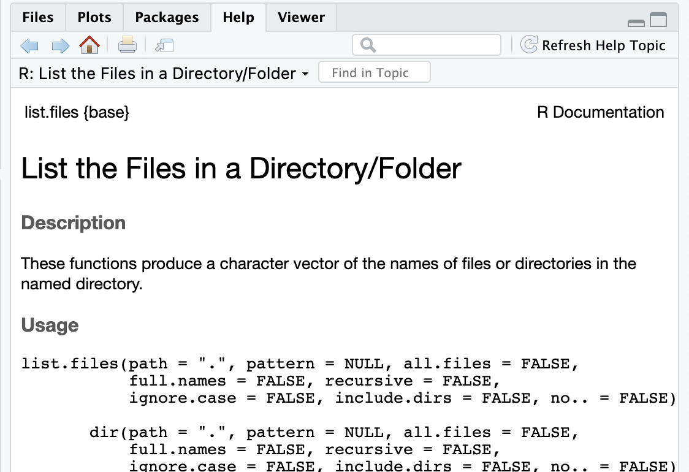
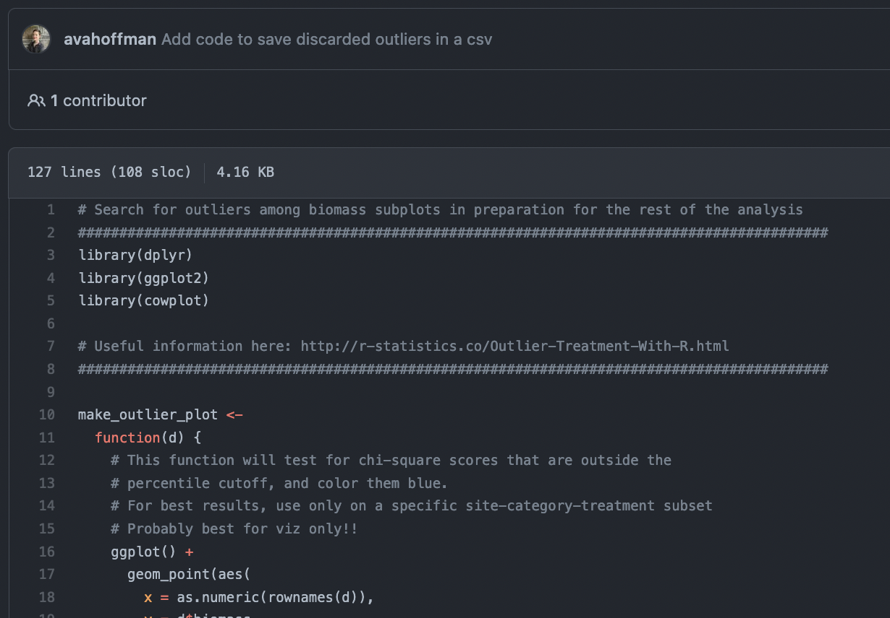
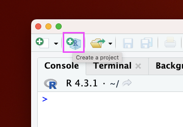
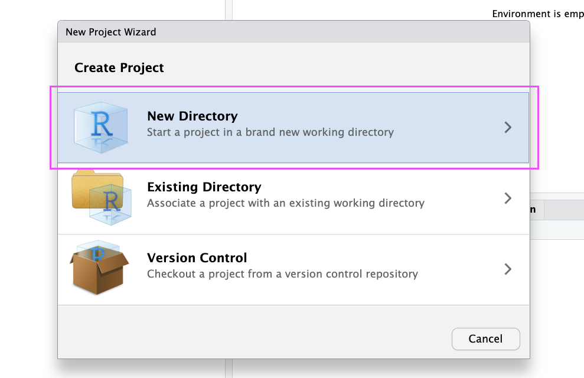
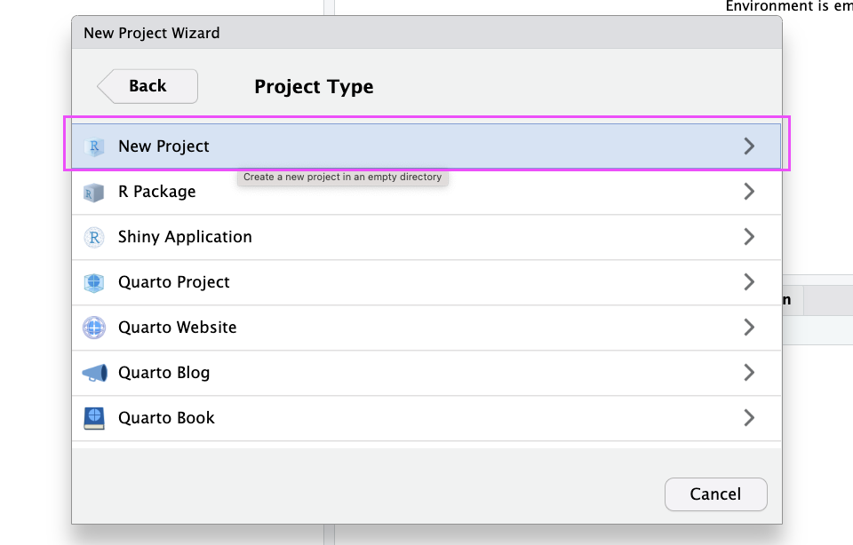
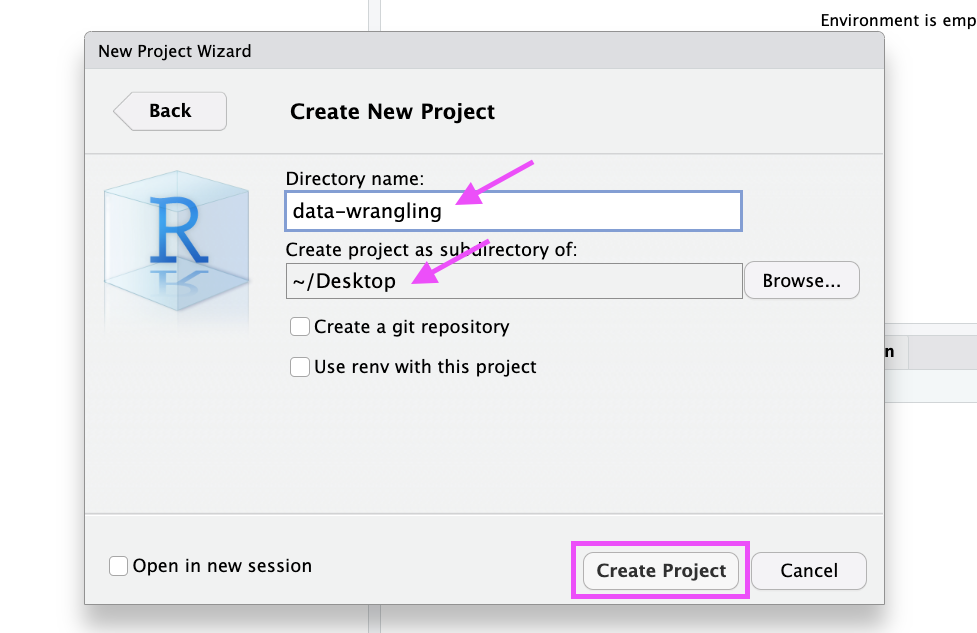
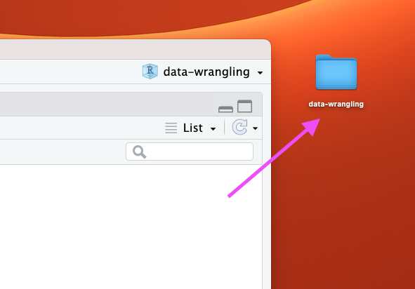
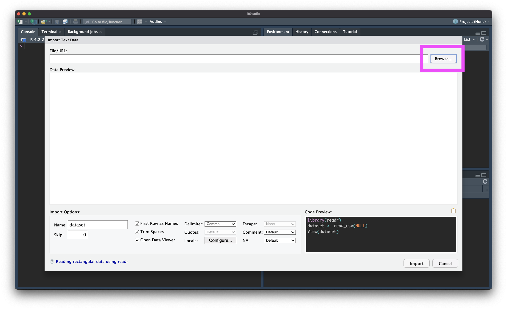

```{r, include = FALSE}
library(knitr)
library(readr)
# suppressPackageStartupMessages(library(dplyr))
knitr::opts_chunk$set(comment = "")
```

# R Basics

## Explaining output on slides

In slides, a command (we'll also call them code or a code chunk) will look like this
```{r code}
head(mtcars)
```

And then directly after it, will be the output of the code.  

These slides were made in R using `knitr` and `R Markdown` (covered later today when we discuss reproducible research)


## R variables 

A few reminders:
* You can create variables from within the R environment and from files on your computer
* Use "<-" to assign values to a variable name
* Variable names are case-sensitive, i.e. X and x are different

```{r assign}
x <- 2
x
x * 4
x + 2
```


## Help

For any function, you can write `?FUNCTION_NAME`, or `help("FUNCTION_NAME")` to look at the help file:

```{r, eval = FALSE}
?dir
help("dir")
```

```{r, echo = FALSE, out.width="70%"}

```


## Packages

Not all packages are available by default.

```{r, eval = FALSE}
install.packages("tidyverse")
library(tidyverse)
```

```{r, echo = FALSE, out.width="70%"}
knitr::include_graphics("media/install_packages.jpg")
```


## Commenting in Scripts

Commenting in code is super important. You should be able to go back to your code years after writing it and figure out exactly what the script is doing. Commenting helps you do this. Also handy for notes!

```{r, out.width="80%", echo=FALSE, fig.alt='.'}
ottrpal::include_slide("https://docs.google.com/presentation/d/104LQkFTsC5R9vAC4HHj4mK7IjCTH55X6BkrAb3aDd6E/edit#slide=id.g13ea04b780d_1_115")
```


## Commenting in Scripts

```{r, echo = FALSE, out.width="70%"}

```


# Data Input

## Outline 

* Part 0: A little bit of set up!
* Part 1: reading in manually (point and click)
* Part 2: reading in directly & working directories
* Part 3: checking data & multiple file formats


# Part 0: Setup - R Project


## New R Project

Let's make an R Project so we can stay organized in the next steps.

Click the new R Project button at the top left of RStudio:

```{r, fig.alt="The New R Project button is highlighted.", out.width = "40%", echo = FALSE, align = "center"}

```


## New R Project

In the New Project Wizard, click "New Directory":

```{r, fig.alt="In the New Project Wizard, the 'New Directory' option is highlighted.", out.width = "60%", echo = FALSE, align = "center"}

```


## New R Project

Click "New Project":

```{r, fig.alt="In the New Project Wizard, the 'New Project' option is highlighted.", out.width = "60%", echo = FALSE, align = "center"}

```


## New R Project

Type in a name for your new folder.

Store it somewhere easy to find, such as your Desktop:

```{r, fig.alt="In the New Project Wizard, the new project has been given a name and is going to be stored in the Desktop directory. The 'Create Project' button is highlighted.", out.width = "60%", echo = FALSE, align = "center"}

```


## New R Project

You now have a new R Project folder on your Desktop! 

Make sure you add any scripts or data files to this folder as we go through today's lesson. This will make sure R is able to "find" your files.

```{r, fig.alt="The image shows an image of an arrow pointing to the newly created R project repository.", out.width = "60%", echo = FALSE, align = "center"}

```


# Part 1: Getting data into R (manual/point and click)


## Data Input

* 'Reading in' data is the first step of any real project/analysis
* R can read almost any file format, especially via add-on packages
* We are going to focus on simple delimited files first
    * comma separated (e.g. '.csv')
    * tab delimited (e.g. '.txt')
    * Microsoft Excel (e.g. '.xlsx')


## Data Input

Youth Tobacco Survey (YTS) dataset:

"The YTS was developed to provide states with comprehensive data on both middle school and high school students regarding tobacco use, exposure to environmental tobacco smoke, smoking cessation, school curriculum, minors' ability to purchase or otherwise obtain tobacco products, knowledge and attitudes about tobacco, and familiarity with pro-tobacco and anti-tobacco media messages."

* Check out the data at: https://catalog.data.gov/dataset/youth-tobacco-survey-yts-data


## Data Input: Dataset Location

Dataset is located at https://sisbid.github.io/Data-Wrangling/data/Youth_Tobacco_Survey_YTS_Data.csv

* Download data by clicking the above link
    
    * Safari - if a file loads in your browser, choose File --> Save As, select, Format "Page Source" and save


## Import Dataset

-  `>` File
-  `>` Import Dataset
-  `>` From Text (`readr`)
-  `>` paste the url (https://sisbid.github.io/Data-Wrangling/data/Youth_Tobacco_Survey_YTS_Data.csv)
-  `>` click "Update" and "Import"


## What Just Happened?

- You see a preview of the data on the top left pane.
- You see a new object called `Youth_Tobacco_Survey_YTS_Data` in your environment pane (top right). The table button opens the data for you to view.
- R ran some code in the console (bottom left).


## Import Dataset (recap)

```{r, fig.alt="Gif showing the process of importing a dataset via readr.", out.width = "100%", echo = FALSE, align = "center"}
knitr::include_graphics("media/Data_Input_import_dataset.gif")
```


## Browsing for Data on Your Machine

```{r, fig.alt="The image shows an image of an arrow pointing to the newly created R project repository.", out.width = "80%", echo = FALSE, align = "center"}

```


## Example 2

-  `>` File
-  `>` Import Dataset
-  `>` From Text (`readr`)
-  `>` paste the url (https://sisbid.github.io/Data-Wrangling/data/dropouts.txt)
-  `>` select delimiter
-  `>` click "Update" and "Import"


## Example 3

```{r}
library(readxl)
```

-  `>` File
-  `>` Import Dataset
-  `>` From Excel
-  `>` paste the url (https://sisbid.github.io/Data-Wrangling/data/asthma.xlsx)
-  `>` click "Update" and "Import"


## Manual Import: Pros and Cons

Pros: easy!!

Cons: obscures some of what's happening, others will have difficulty running your code


## Summary & Lab

Review the process: [`https://youtu.be/LEkNfJgpunQ`](https://youtu.be/LEkNfJgpunQ)

-  `>` File
-  `>` Import Dataset
-  `>` From Text (`readr`)
-  `>` paste the url / browse
-  `>` click "Update" and "Import"

https://sisbid.github.io/Data-Wrangling/labs/data-io-lab-part1.Rmd


