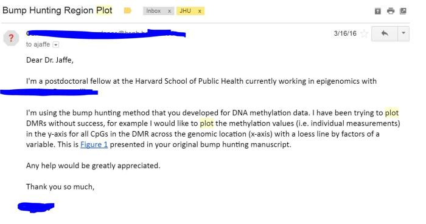
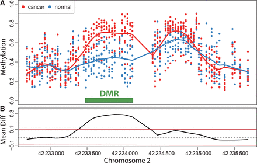

```{r, echo = FALSE, message=FALSE}
library(knitr)
library(readr)
# suppressPackageStartupMessages(library(dplyr))
opts_chunk$set(comment = "")
```

## Explaining output on slides

In slides, a command (we'll also call them code or a code chunk) will look like this
```{r code}
print("I'm code")
```

And then directly after it, will be the output of the code.  
So `print("I'm code")` is the code chunk and [1] "I'm code" is the output. 

These slides were made in R using `knitr` and `R Markdown` which is covered in later modules, like reproducible research.


## Common new user mistakes we have seen

1.  **Working directory problems: trying to read files that R "can't find"**
    - RStudio can help, and so do RStudio Projects
    - discuss in this Data Input/Output lecture
2.  Lack of comments in code
3.  Typos (R is **case sensitive**, `x` and `X` are different)
    - RStudio helps with "tab completion"
    - discussed throughout
4.  Data type problems (is that a string or a number?)
5.  Open ended quotes, parentheses, and brackets     
6.  Different versions of software
    
## Working Directories

* R "looks" for files on your computer relative to the "working" directory
* Many people recommend not setting a directory in the scripts 
    - assume you're in the directory the script is in
    - If you open an R file with a new RStudio session, it does this for you.
* If you do set a working directory, do it at the beginning of your script. 
* Example of getting and setting the working directory:

```{r workingDirectory,eval=FALSE}
## get the working directory
getwd()
setwd("~/Lectures") 
```


## Setting a Working Directory

* Setting the directory can sometimes be finicky
    * **Windows**: Default directory structure involves single backslashes ("\"), but R interprets these as "escape" characters. So you must replace the backslash with forward slashes ("/") or two backslashes ("\\")
    * **Mac/Linux**: Default is forward slashes, so you are okay
* Typical directory structure syntax applies
    * ".." - goes up one level
    * "./" - is the current directory
    * "~" - is your "home" directory

## Working Directory 

Note that the `dir()` function interfaces with your operating system and can show you which files are in your current working directory. 

You can try some directory navigation: 

```{r directoryNav}
dir("./") # shows directory contents
dir("..")
```

## Relative vs. absolute paths (From Wiki)

*An **absolute or full path** points to the same location in a file system, regardless of the current working directory. To do that, it must include the root directory.*

This means if I try your code, and you use absolute paths, it won't work unless we have the exact same folder structure where R is looking (bad).

*By contrast, a **relative path starts from some given working directory**, avoiding the need to provide the full absolute path. A filename can be considered as a relative path based at the current working directory. *

## Setting the Working Directory

In RStudio, go to `Session --> Set Working Directory --> To Source File Location`

RStudio should put code in the Console, similar to this:
```{r, eval = FALSE}
setwd("~/Lectures/Data_IO/lecture")
```
    

## Getting Started

* You should have the latest version of R installed!
* Open R Studio
* Files --> New --> R Script
* Save the blank R script as "day1.R" in a directory of your choosing
* Add a comment header

## Setting the Working Directory
    
Again, if you open an R file with a new RStudio session, it does this for you.  You may need to make this a default.

1. Make sure RStudio is the default application to open .R files
    * Mac - right click --> Get Info --> Open With: RStudio --> Change All
    * Windows - Andrew will show
2. Close RStudio Double click `day1.R`

* Confirm the directory contains "day1.R" using `dir()`:
    * Type `dir()` in the R Console (`day1.R` should be there)    

## Help

For any function, you can write `?FUNCTION_NAME`, or `help("FUNCTION_NAME")` to look at the help file:

```{r, eval = FALSE}
?dir
help("dir")
```

## Commenting in Scripts

Commenting in code is super important. You should be able to go back to your code years after writing it and figure out exactly what the script is doing. Commenting helps you do this. This happens to me often...

## Commenting in Scripts




## Commenting in Scripts



## Commenting in Scripts


## Commenting in Scripts

Add a comment header to day1.R :`#` is the comment symbol

```{r}
#################
# Title: Demo R Script
# Author: Andrew Jaffe
# Date: 7/10/2017
# Purpose: Demonstrate comments in R
###################
 
# nothing to its right is evaluated

# this # is still a comment
### you can use many #'s as you want

# sometimes you have a really long comment,
#    like explaining what you are doing 
#    for a step in analysis. 
# Take it to another line
```


## Data Input

* 'Reading in' data is the first step of any real project/analysis
* R can read almost any file format, especially via add-on packages
* We are going to focus on simple delimited files first
    * tab delimited (e.g. '.txt')
    * comma separated (e.g. '.csv')
    * Microsoft excel (e.g. '.xlsx')

## Data Input

UFO Sightings via Kaggle.com: "Reports of unidentified flying object reports in the last century". 

"There are two versions of this dataset: scrubbed and complete. The complete data includes entries where the location of the sighting was not found or blank (0.8146%) or have an erroneous or blank time (8.0237%). Since the reports date back to the 20th century, some older data might be obscured. Data contains city, state, time, description, and duration of each sighting."

https://www.kaggle.com/NUFORC/ufo-sightings

## Data Input
* Download data from http://sisbid.github.io/Module1/data/ufo/ufo_data_complete.csv.gz
* Extract the CSV from the zipped file
* Save it (or move it) to the same folder as your day1.R script
* Within RStudio: Session --> Set Working Directory --> To Source File Location

## Data Input

Easy way: R Studio features some nice "drop down" support, where you can run some tasks by selecting them from the toolbar.

For example, you can easily import text datasets using the "Tools --> Import Dataset" command. Selecting this will bring up a new screen that lets you specify the formatting of your text file. 

After importing a datatset, you get the corresponding R commands that you can enter in the console if you want to re-import data.

## Data Input

Initially-harder-but-gets-way-easier way: Utilizing functions like `read.table()`, and `read.csv()` or the equivalent packages in the `readr` package called `read_delim()` and `read_csv()`. 


## Data Input

So what is going on "behind the scenes"?

`read_delim()`: Read a delimited file into a data frame.

```
read_delim(file, delim, quote = "\"", escape_backslash = FALSE,
  escape_double = TRUE, col_names = TRUE, col_types = NULL,
  locale = default_locale(), na = c("", "NA"), quoted_na = TRUE,
  comment = "", trim_ws = FALSE, skip = 0, n_max = Inf,
  guess_max = min(1000, n_max), progress = interactive())
           
# for example: `read_delim("file.txt",delim="\t")`
```

## Data Input

* The filename is the path to your file, in quotes
* The function will look in your "working directory" if no absolute file path is given
* Note that the filename can also be a path to a file on a website (e.g. 'www.someurl.com/table1.txt')


## Data Input

There is another convenient function for reading in CSV files, where the delimiter is assumed to be a comma: 

```{r readCSV}
read_csv
```

## Data Input

* Here would be reading in the data from the command line, specifying the file path:

```{r readCSV2}
ufo = read_csv("../data/ufo/ufo_data_complete.csv")
```

The data is now successfully read into your R workspace, just like from using the dropdown menu.

## Data Input

The `read_delim()` and related functions returns a "tibble" is a `data.frame` with special printing, which is the primary data format for most data cleaning and analyses. 

## Data Input with `tbl_df`s {.smaller}

* When using the dropdown menu in RStudio, it uses `read_csv`, which is an improved version of reading in CSVs.  It is popular but `read.csv` is still largely used.  It returns a `tbl` (tibble), that is a `data.frame` with improved printing and subsetting properties: 

```{r readCSV_readr, message=FALSE}
library(readr)
head(ufo)
class(ufo)
```

## Data Input

```{r, viewTibble}
ufo
```


## Data Input

There are also data importing functions provided in base R (rather than the `readr` package), like `read.delim` and `read.csv`. 

These functions have slightly different syntax for reading in data, like `header` and `as.is`. 

However, while many online resources use the base R tools, the latest version of RStudio switched to use these new `readr` data import tools, so we will use them in the class for slides. They are also up to two times faster for reading in large datasets, and have a progress bar which is nice. 

But you can use whatever function you feel more comfortable with.

## Data Input

Here is how to read in the same dataset using base R functionality, which returns a `data.frame` directly

```{r, readingCSV}
dat2 = read.csv("../data/ufo/ufo_data_complete.csv",as.is=TRUE)
head(dat2)
```

## R variables

* The most comfortable and familiar class/data type for many of you will be `data.frame`
* You can think of these as essentially Excel spreadsheets with rows (usually subjects or observations) and columns (usually variables)

## Data Classes:

* One dimensional classes ('vectors'):
    * Character: strings or individual characters, quoted
    * Numeric: any real number(s)
    * Integer: any integer(s)/whole numbers
    * Factor: categorical/qualitative variables
    * Logical: variables composed of TRUE or FALSE
    * Date/POSIXct: represents calendar dates and times


# R variables

## Numeric

You can perform functions to entire vectors of numbers very easily.

```{r assign4}
x = c(3,68,4,2)
x + 2
x * 3
x + c(1, 2, 3, 4)
```

## R variables

But things like algebra can only be performed on numbers.


```
> c("Andrew", "Jaffe") + 4
[1] Error in name2 * 4 : non-numeric argument
 to binary operator
```

## R variables

And save these modified vectors as a new vector.

```{r assign5}
y = "Hello World"
y
y = x + c(1, 2, 3, 4)
y 
```

Note that the R object `y` is no longer "Hello  World!" - It has effectively been overwritten by assigning new data to the variable

## R variables

* You can get more attributes than just class.  The function `str` gives you the structure of the object.

```{r assign2}
class(x)
str(x)
```
This tells you that `x` is a numeric vector and tells you the length.

## Logical

`logical` is a class that only has two possible elements: `TRUE` and `FALSE`

```{r logical1}
x = c(TRUE, FALSE, TRUE, TRUE, FALSE)
class(x)
is.numeric(c("Andrew", "Jaffe"))
is.character(c("Andrew", "Jaffe"))
```

## Logical

Note that `logical` elements are NOT in quotes. 
```{r logical2}
z = c("TRUE", "FALSE", "TRUE", "FALSE")
class(z)
as.logical(z)
```

Bonus: `sum()` and `mean()` work on `logical` vectors - they return the total and proportion of `TRUE` elements, respectively.

```{r logical_z}
sum(as.logical(z))
```

## General Class Information

There are two useful functions associated with practically all R classes, which relate to logically checking the underlying class (`is.CLASS_()`) and coercing between classes (`as.CLASS_()`).

```{r logical_coercion}
is.numeric(c("Andrew", "Jaffe"))
is.character(c("Andrew", "Jaffe"))
```

## General Class Information

There are two useful functions associated with practically all R classes, which relate to logically checking the underlying class (`is.CLASS_()`) and coercing between classes (`as.CLASS_()`).

```{r logical_coercion2}
as.character(c(1, 4, 7))
as.numeric(c("Andrew", "Jaffe"))
```


## Factors

A `factor` is a special `character` vector where the elements have pre-defined groups or 'levels'. You can think of these as qualitative or categorical variables:

```{r factor1}
x = factor(c("boy", "girl", "girl", "boy", "girl"))
x 
class(x)
```

Note that levels are, by default, in alphanumerical order.

## Factors

Factors are used to represent categorical data, and can also be used for ordinal data (ie categories have an intrinsic ordering)

Note that R reads in character strings as factors by default in functions like `read.table()`

'The function factor is used to encode a vector as a factor (the terms 'category' and 'enumerated type' are also used for factors). If argument ordered is TRUE, the factor levels are assumed to be ordered.'

```
factor(x = character(), levels, labels = levels,
       exclude = NA, ordered = is.ordered(x))
```

## Factors

Suppose we have a vector of case-control status

```{r factor2}
cc = factor(c("case","case","case",
        "control","control","control"))
cc
levels(cc) = c("control","case")
cc
```

## Factors

Note that the levels are alphabetically ordered by default. We can also specify the levels within the factor call

```{r factor_cc_again}
casecontrol = c("case","case","case","control",
          "control","control")
factor(casecontrol, levels = c("control","case") )
factor(casecontrol, levels = c("control","case"), 
       ordered=TRUE)
```

## Factors

Factors can be converted to `numeric` or `character` very easily

```{r factor3}
x = factor(casecontrol,
        levels = c("control","case") )
as.character(x)
as.numeric(x)
```

## Factors

However, you need to be careful modifying the labels of existing factors, as its quite easy to alter the meaning of the underlying data. 

```{r factorCheck}
xCopy = x
levels(xCopy) = c("case", "control") # wrong way
xCopy        
as.character(xCopy) # labels switched
as.numeric(xCopy)
```

## Date

You can convert date-like strings in the `Date` class (http://www.statmethods.net/input/dates.html for more info)

```{r date}
theDate = c("01/21/1990", "02/01/1989", "03/23/1988")
sort(theDate)
newDate <- as.Date(theDate, "%m/%d/%Y")
sort(newDate)
```

## Date 

However, the `lubridate` package is much easier for generating explicit dates:

```{r, message=FALSE}
library(lubridate) # great for dates!
newDate2 = mdy(theDate)
newDate2
```

## POSIXct

The `POSIXct` class is like a more general date format (with hours, minutes, seconds).

```{r}
theTime = Sys.time()
theTime
class(theTime)
theTime + as.period(20, unit = "minutes") # the future
```

## Data Classes:

* Two dimensional classes:
    * `data.frame`: traditional 'Excel' spreadsheets
        * Each column can have a different class, from above
    * Matrix: two-dimensional data, composed of rows and columns. Unlike data frames, the entire matrix is composed of one R class, e.g. all numeric or all characters.
    
## Matrix (and Data frame) Functions

These are in addition to the previous useful vector functions:

* `nrow()` displays the number of rows of a matrix or data frame
* `ncol()` displays the number of columns 
* `dim()` displays a vector of length 2: # rows, # columns
* `colnames()` displays the column names (if any) and `rownames()` displays the row names (if any)

## Data Frames

The `data.frame` is the other two dimensional variable class. 

Again, data frames are like matrices, but each column is a vector that can have its own class. So some columns might be `character` and others might be `numeric`, while others maybe a `factor`.

## Lists

* One other data type that is the most generic are `lists`.
* Can be created using `list()`
* Can hold vectors, strings, matrices, models, list of other list, lists upon lists!

```{r makeList, comment="", prompt=TRUE}
mylist <- list(letters=c("A", "b", "c"), 
        numbers=1:3, matrix(1:25, ncol=5))
mylist
```


## More on Data Frames

```{r subset5}
colnames(ufo) # column names
head(ufo$city) # first few rows
```


## Data Output

While its nice to be able to read in a variety of data formats, it's equally important to be able to output data somewhere.

`write.table()`: prints its required argument `x` (after converting it to a `data.frame` if it is not one nor a `matrix`) to a file or connection.

```
write.table(x,file = "", append = FALSE, quote = TRUE, sep = " ",
            eol = "\n", na = "NA", dec = ".", row.names = TRUE,
            col.names = TRUE, qmethod = c("escape", "double"),
            fileEncoding = "")
```

## Data Output

`x`: the R `data.frame` or `matrix` you want to write

`file`: the file name where you want to R object written. It can be an absolute path, or a filename (which writes the file to your working directory)

`sep`: what character separates the columns? 

* "," = .csv - Note there is also a `write.csv()` function
* "\t" = tab delimited

`row.names`: I like setting this to FALSE because I email these to collaborators who open them in Excel

## Data Output

For example, we can write back out the Monuments dataset with the new column name:

```{r writecsv}
write.csv(ufo[1:100,], file="ufo_first100.csv", row.names=FALSE)
```

Note that `row.names=TRUE` would make the first column contain the row names, here just the numbers `1:nrow(mon)`, which is not very useful for Excel. Note that row names can be useful/informative in R if they contain information (but then they would just be a separate column). 

## Data Input - Excel

Many data analysts collaborate with researchers who use Excel to enter and curate their data. Often times, this is the input data for an analysis. You therefore have two options for getting this data into R:

* Saving the Excel sheet as a .csv file, and using `read.csv()`
* Using an add-on package, like `readxl`

For single worksheet .xlsx files, I often just save the spreadsheet as a .csv file (because I often have to strip off additional summary data from the columns)

For an .xlsx file with multiple well-formated worksheets, I use the `readxl`package for reading in the data.

## Data Input - Other Software

* **haven** package (https://cran.r-project.org/web/packages/haven/index.html) reads in SAS, SPSS, Stata formats
* **sas7bdat** reads .sas7bdat files
* **foreign** package - can read all the formats as **haven**.  Around longer (aka more testing), but not as maintained (bad for future).

