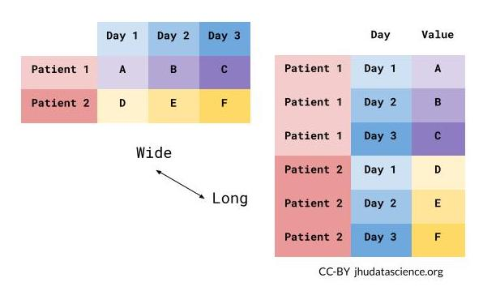

```{r, echo = FALSE, include=FALSE}
library(knitr)
library(readr)
opts_chunk$set(comment = "")
library(tidyverse)
```

## Reshaping Data 

```{r, echo = FALSE, message=FALSE}
library(tidyverse)
```

In this module, we will show you how to:

1. Reshape data from wide (fat) to long (tall)
2. Reshape data from long (tall) to wide (fat)
3. Merge Data/Joins
4. Perform operations by a grouping variable

## What is wide/long data?

Data is stored *differently* in the tibble.

```{r, echo = FALSE}
ex_wide = tibble(State = "Alabama",
                 June_vacc_rate = "37.2%",
                 May_vacc_rate = "36.0%",
                 April_vacc_rate = "32.4%"
                     )
ex_long = pivot_longer(ex_wide, cols = c(June_vacc_rate, May_vacc_rate, April_vacc_rate))
```

Wide: has many columns

```{r, echo = FALSE}
ex_wide
```
Long: column names become data
```{r, echo = FALSE}
ex_long
```

## What is wide/long data?

```{r, echo = FALSE}
ex_wide = tibble(State = c("Alabama", "Alaska"),
                 June_vacc_rate = c("37.2%", "47.5%"),
                 May_vacc_rate = c("36.0%", "46.2%"),
                 April_vacc_rate = c("32.4%", "41.7%")
                     )
ex_long = pivot_longer(ex_wide, cols = c(June_vacc_rate, May_vacc_rate, April_vacc_rate))
```

Wide: multiple columns per individual, values spread across multiple columns 
```{r, echo = FALSE}
ex_wide
```

Long: multiple rows per observation, a single column contains the values
```{r, echo = FALSE}
ex_long
```

## What is wide/long data?

<div style="font-size:40pt">
Data is wide or long **with respect** to certain variables.
</div>

```{r, fig.alt="Wide versus long data rearanges the position of column names and row content.", out.width = "60%", echo = FALSE, fig.align='center'}

```

## What is wide/long data?

```{r, fig.alt="Wide versus long data rearanges the position of column names and row content, animated.", out.width = "50%", echo = FALSE, fig.align='center'}
knitr::include_graphics("media/Reshape_pivot_animated.gif")
```

<div style="font-size:10pt">
[https://github.com/gadenbuie/tidyexplain/blob/master/images/tidyr-spread-gather.gif](https://github.com/gadenbuie/tidyexplain/blob/master/images/tidyr-spread-gather.gif)
</div>

## Why do we need to switch between wide/long data?

Wide: **Easier for humans to read**
```{r, echo = FALSE}
ex_wide
```

Long: **Easier for R to make plots & do analysis**
```{r, echo = FALSE}
ex_long
```

## Data used: Charm City Circulator

http://jhudatascience.org/intro_to_r/data/Charm_City_Circulator_Ridership.csv

```{r, message = FALSE}
circ = read_csv(
  paste0("http://jhudatascience.org/intro_to_r/",
         "data/Charm_City_Circulator_Ridership.csv"))
head(circ, 5)
```

## tidyr package

`tidyr` allows you to "tidy" your data.  We will be talking about:

- `pivot_longer` - make multiple columns into variables, (wide to long)
- `pivot_wider` - make a variable into multiple columns, (long to wide)
- `separate` - string into multiple columns
- `unite` - multiple columns into one string

The `reshape` command exists.  It is a **confusing** function.  Don't use it.

## Reshaping data from wide (fat) to long (tall): tidyr 

`tidyr::pivot_longer` - puts column data into rows.

- First describe which columns we want to "pivot_longer"
- `names_to =` gives a new name to the pivoted columns
- `values_to =` gives a new name to the values that used to be in those columns

```{r}
long = circ %>% 
  pivot_longer(starts_with(c("orange","purple","green","banner")),
               names_to = "var", values_to = "number")
long
```


## Reshaping data from wide (fat) to long (tall): tidyr 

We have many columns here, so we could instead use the `!` to say which columns we *don't* want to pivot.  

```{r}
long = circ %>% pivot_longer(!c(day, date, daily),
                    names_to = "var", values_to = "number")
long
```

## Reshaping data from wide (fat) to long (tall): tidyr 

```{r}
long %>% count(var)
```

## Making a separator

We will use `str_replace` from the `stringr` package to put `_` in the names

```{r}
long = long %>% mutate(
  var = str_replace(var, "Board", "_Board"),
  var = str_replace(var, "Alight", "_Alight"),
  var = str_replace(var, "Average", "_Average") 
)
long
```

## Reshaping data from wide (fat) to long (tall): tidyr

Now each `var` is Boardings, Averages, or Alightings.  We use "`into =`" to name the new columns and "`sep =`" to show where the separation should happen.

```{r}
long = 
  long %>% 
  separate(var, into = c("line", "type"), sep = "_")
long
```

## Re-uniting all the lines

If we had the opposite problem, we could use the `unite` function:

```{r}
reunited = long %>% 
  unite(var, line, type, sep = "_")  
reunited
```

## Reshaping data from long (tall) to wide (fat): tidyr

In `tidyr`, the `pivot_wider` function spreads rows into columns.  Now we have a long data set, but we want to separate the Average, Alightings and Boardings into different columns:

```{r}
wide = long %>% pivot_wider(names_from = "type", 
                            values_from = "number") 
wide
```

## `pivot_longer`

```{r, fig.alt="Long form sandwich", out.width = "50%", echo = FALSE, fig.align='center'}

```
