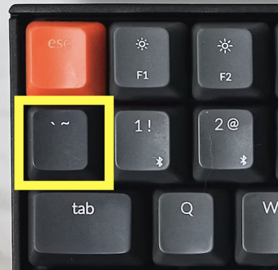

```{r, include=FALSE}
library(knitr)
knitr::opts_chunk$set(comment = "")
library(tidyverse)
```


# Subsetting part 2

## Data

Let's continue to work with the Diamond dataset from the `ggplot2` package of the tidyverse. 

We will often use the `glimpse()` function of the `dplyr` package of the `tidyverse` to look at a rotated view of the data.

```{r}
library(tidyverse)
head(diamonds)
```

## Let's learn more about this data

We can use `?diamonds` to get more informatin in the `Help` pane.

We might decide to rename some columns,

- `x` to be `length`
- `y` to be `width` 
- `z` to be `depth`
- but first changing `depth` to be `depth_percentage`

## Renaming Columns of a data frame or tibble

To rename columns in `dplyr`, you can use the `rename` function.

Notice the new name is listed **first**!

<div class = "codeexample">
```{r, eval = FALSE}
# general format! not code!
{data you are creating or changing} <- {data you are using} %>%
                                    rename({New Name} = {Old name})
                                          
```
</div>

```{r}

diamonds_2<- diamonds %>%
  rename(depth_percentage = depth)
head(diamonds_2, n = 3)
```


## More Renaming

```{r}
diamonds_2<- diamonds %>%
  rename(depth_percentage = depth,
                   length = x,
                    width = y,
                    depth = z)
glimpse(diamonds_2)
```

## Take Care with Column Names

When you can, avoid spaces, special punctuation, or numbers in column names, as these require special treatment to refer to them. 

See https://jhudatascience.org/intro_to_r/quotes_vs_backticks.html for more guidance.

```{r, eval = FALSE}
diamonds %>% rename(depth percentage = depth)# this will cause an error
```

```{r, eval = FALSE}
diamonds %>% rename(depth_percentage = depth) # this will work
```

```{r, eval = FALSE}
diamonds %>% rename(`depth percentage` = depth) # not recommended
```

## Unusual Column Names

It's best to avoid unusual column names where possible, as things get tricky later.

We just showed the use of \` backticks\` . You may see people use quotes as well.

```{r, fig.alt="dplyr", out.width = "14%", echo = FALSE, fig.align='center'}

```

Other atypical column names are those with:

- spaces
- number without characters
- number starting the name
- other punctuation marks (besides "_" or "." and not at the beginning)


## A solution!

Rename tricky column names so that you don't have to deal with them later!

```{r, fig.align='center', echo = FALSE}
include_graphics("https://media.giphy.com/media/6q29hxDKvJvPy/giphy.gif")
```

## Example

```{r, echo = FALSE}
diamonds_bad_names <- rename(diamonds, `Price(in US dollars)` = price,
                                        `Length (in mm)` = x,
                                        `Width in mm` = y,
                                        `Depth percentage` = z)
```

```{r}
glimpse(diamonds_bad_names)
diamonds_bad_names %>%
        rename(price = `Price(in US dollars)`)
```

## Renaming all columns of a data frame: dplyr {.codesmall}

To rename all columns you use the `rename_with()`. In this case we will use `toupper()` to make all letters upper case. Could also use `tolower()` function.

```{r}
diamonds_upper <- diamonds %>% rename_with(toupper)
head(diamonds_upper, 2)
```

```{r}
diamonds_upper %>% rename_with(tolower) %>% head(n = 2)
```

## Janitor package

```{r, message=FALSE}
#install.packages("janitor")
library(janitor)
clean_names(diamonds_bad_names) %>% glimpse()
```

# Subset based on a class

## The `where()` function can help select columns of a specific class

`is.character()` and `is.numeric()` are often the most helpful

```{r}
head(diamonds, 2)
diamonds %>% select(where(is.numeric)) %>% head(n = 2)

```

## The `where()` function can help select columns of a specific class

`is.character()` and `is.numeric()` are often the most helpful

```{r}
head(diamonds, 2)
diamonds %>% select(where(is.ordered)) %>% head(n = 2)

```


## `distinct()` function

To filter for distinct values from a variable, multiple variables, or an entire tibble you can use the `distinct()` function from the `dplyr` package. Similar to count, but without the number of times the value shows up.

```{r}
distinct(diamonds, cut)
```

# Adding/Removing Columns


## Adding columns to a data frame: dplyr (`tidyverse` way){.codesmall}

The `mutate` function in `dplyr` allows you to add or modify columns of a data frame.

<div class = "codeexample">
```{r, eval = FALSE}
# General format - Not the code!
{data object to update} <- {data to use} %>% 
                    mutate({new variable name} = {new variable source}) 
```
</div>

1 US dollar = 1.32 Canadian dollars

```{r}
diamonds %>% 
  mutate(price_canadian = price * 1.32) %>% glimpse()

```


## Use mutate to modify existing columns {.codesmall}

The `mutate` function in `dplyr` allows you to add or modify columns of a data frame.

<div class = "codeexample">
```{r, eval = FALSE}
# General format - Not the code!
{data object to update} <- {data to use} %>%
            mutate({variable name to change} = {variable modification}) 
```
</div>

```{r}
mutate(diamonds, price = price * 1.32) %>% glimpse()
```


## remember to save your data

If you want to actually make the change you need to reassign the data object.

```{r, eval = FALSE}
diamonds <- diamonds %>% mutate(price = price * 1.32) %>% glimpse()
```

## Removing columns of a data frame: dplyr {.codesmall}

The `select` function can remove a column with minus (`-`)

```{r}
select(diamonds, - price) %>% glimpse()
```


**Or, you can simply select the columns you want to keep, ignoring the ones you want to remove.**

## Removing columns in a data frame: dplyr {.codesmall}

You can use `c()` to list the columns to remove.

Remove `newcol` and `drat`:
```{r}
select(diamonds, -c("x", "y", "z")) %>% glimpse()
```


# Ordering columns

## Ordering the columns of a data frame: dplyr 

The `select` function can reorder columns.
```{r}
head(diamonds, n = 2)
diamonds %>% select(price, depth, carat, cut, color) %>% head(n = 2)
```

## Ordering the columns of a data frame: dplyr {.codesmall}

The `select` function can reorder columns.  Put `price` first, then select the rest of columns:

```{r}
head(diamonds, n = 2)
diamonds %>% select(price, everything()) %>% head(n = 2)
```


## Ordering the columns of a data frame: dplyr {.codesmall}

Put `price` at the end ("remove, everything, then add back in"):

```{r}
head(diamonds, n = 2)
diamonds %>% select(-price, everything(), price) %>% head(n = 2)
```


## Ordering the columns of a data frame: dplyr {.codesmall}

In addition to `select` we can also use the `relocate()` function of dplyr to rearrange the columns for more complicated moves.

For example, let say we just wanted `price` to be before `carat`.

```{r}
head(diamonds, n = 2)
diamonds %>% relocate( price, .before = cut) %>% head(n = 2)

```


## Ordering the column names of a data frame: alphabetically {.codesmall}

Using the base R `order()` function.

```{r}
order(colnames(diamonds))
diamonds %>% select(order(colnames(diamonds)))
```


# Ordering rows

## Ordering the rows of a data frame: dplyr

The `arrange` function can reorder rows  By default, `arrange` orders in increasing order:
```{r}
diamonds %>% arrange(cut)
```

## Ordering the rows of a data frame: dplyr

Use the `desc` to arrange the rows in descending order:
```{r}
diamonds %>% arrange(depth)
```
## Ordering the rows of a data frame: dplyr

Use the `desc` to arrange the rows in descending order:
```{r}
diamonds %>% arrange(desc(price))
```

## Ordering the rows of a data frame: dplyr

You can combine increasing and decreasing orderings:
```{r}
arrange(diamonds, desc(carat), table)
```

## Summary

- `select()` and `relocate()` can be used to reorder columns
- `arrange()` can be used to reorder rows
- can arrange in descending order with `desc()`
- can remove rows with `filter()`
- can remove a column in a few ways:
    - using `select()` with negative sign in front of column name(s)
    - jut not selecting it
- `mutate()` can be used to modify an exisiting variable or make a new variable


## Lab

[Link to Lab](http://sisbid.github.io/Data-Wrangling/labs/data-subsetting-lab-part2.Rmd)
