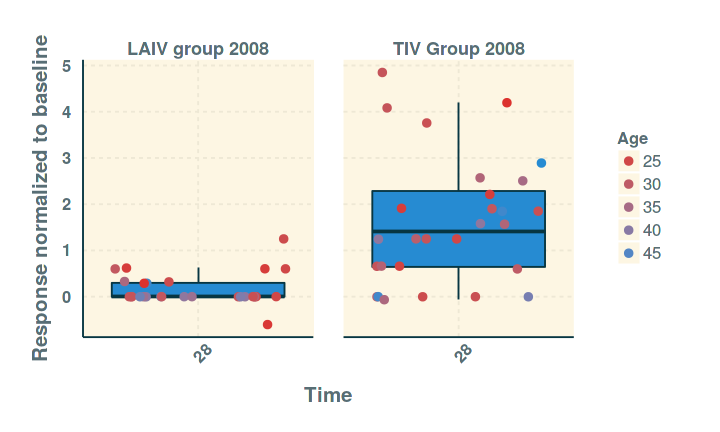
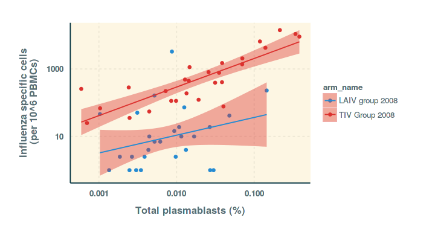
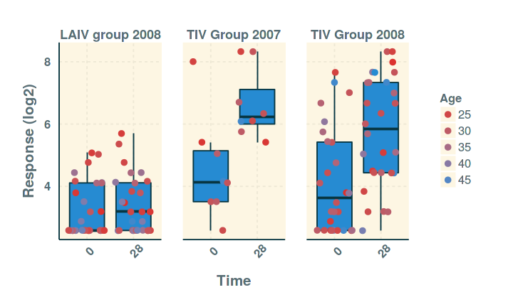

# SISBD: ImmuneSpace
Raphael Gottardo  
 `r Sys.Date()`  


## ImmuneSpace

[ImmuneSpace](www.immunespace.org) is the central database and analysis engine of the Human Immunology Project Consortium.
  

## ImmuneSpaceR

The R package is under development and available from `GitHub`.

```r
library(devtools)
install_github("cttobin/ggthemr") # Themes for ggplot2
install_github("RGLab/ImmuneSpaceR", quick = TRUE)
```

### Requirements

Create netrc file in the computer running R.

- On a UNIX system this file should be named `.netrc` (dot netrc)  
- On windows it sould be named `_netrc` (underscore netrc).  

The file should be located in the users home directory and the permissions on
thefile should be unreadable for everybody except the owner. To determine home
directory, run `Sys.getenv("HOME")` in R. The following three lines must be
included in the .netrc or _netrc file either separated by white space (spaces,
tabs, or newlines) or commas.

    machine   www.immunespace.org
    login     SISBD   
    password  *user-password*
    

## Connection object

ImmuneSpaceR creates object of class `ImmuneSpaceConnection` that can handle all
the data for an entire study.

```r
library(data.table)
library(ImmuneSpaceR)
sdy269 <- CreateConnection("SDY269")
class(sdy269)
```

```
## [1] "ImmuneSpaceConnection"
## attr(,"package")
## [1] "ImmuneSpaceR"
```

```r
sdy269
```

```
## Immunespace Connection to study SDY269
## URL: https://www.immunespace.org/Studies/SDY269
## User: unknown_user at not_a_domain.com
## Available datasets
## 	pcr
## 	elisa
## 	hai
## 	demographics
## 	fcs_analyzed_result
## 	elispot
## 	cohort_membership
## 	fcs_sample_files
## 	gene_expression_files
## Expression Matrices
## 	LAIV_2008
## 	TIV_2008
```

## Reference classes

`ImmuneSpaceConnection` objects use a different class system: Reference classes (or R5).

Reference classes are closer to classic OO systems like in Java or C#. They
are particulary useful to handle big data because the instantiated objects are 
**mutable**. This prevents R's copy on write mechanism.

Methods are called in a slightly different way:

```r
object$method(arg1 = val1, ...)
```

Additional info: http://adv-r.had.co.nz/R5.html

## Connection object: Data


```r
hai <- sdy269$getDataset("hai")
head(hai[, list(subject_accession, virus_strain, study_time_collected, value_reported)])
```

```
##    subject_accession                           virus_strain
## 1:         SUB112829                       B/Florida/4/2006
## 2:         SUB112829 A/Uruguay/716/2007  NYMC X-175C (H3N2)
## 3:         SUB112829           A/South Dakota/6/2007 (H1N1)
## 4:         SUB112829           A/South Dakota/6/2007 (H1N1)
## 5:         SUB112829                       B/Florida/4/2006
## 6:         SUB112829 A/Uruguay/716/2007  NYMC X-175C (H3N2)
##    study_time_collected value_reported
## 1:                    0             20
## 2:                    0             40
## 3:                   28             40
## 4:                    0             40
## 5:                   28             40
## 6:                   28             40
```

## Connection object: Data
The `quick_plot` method 

```r
sdy269$quick_plot("hai", color = "Age")
```

 

## Connection object: Caching
To avoid downloading big datasets multiple times, the connection object caches the
tables that have been fetched. Getting the same table a second time will be much
faster.

```r
head(sdy269$data_cache$hai[, 6:9, with = FALSE], 3)
```

```
##    study_time_collected study_time_collected_unit
## 1:                    0                      Days
## 2:                    0                      Days
## 3:                   28                      Days
##                              virus_strain value_reported
## 1:                       B/Florida/4/2006             20
## 2: A/Uruguay/716/2007  NYMC X-175C (H3N2)             40
## 3:           A/South Dakota/6/2007 (H1N1)             40
```
Clearing the cache

```r
# Clear the saved copy of the data and re-download it
hai <- sdy269$getDataset("hai", reload = TRUE)
# Clear ALL cached data in the object
sdy269$clear_cache()
```

## Connection object: Views

The 'full' view available online can be downloaded using the original_view argument
of the `getDataset` function.

```r
sdy269$getDataset("hai", original_view = TRUE)
```

```
##      subject_accession arm_accession biosample_accession
##   1:         SUB112829       ARM1888            BS586380
##   2:         SUB112829       ARM1888            BS586380
##   3:         SUB112829       ARM1888            BS586604
##   4:         SUB112829       ARM1888            BS586380
##   5:         SUB112829       ARM1888            BS586604
##  ---                                                    
## 332:         SUB112888       ARM1889            BS586659
## 333:         SUB112888       ARM1889            BS586435
## 334:         SUB112888       ARM1889            BS586659
## 335:         SUB112888       ARM1889            BS586659
## 336:         SUB112888       ARM1889            BS586435
##      expsample_accession experiment_accession study_accession
##   1:            ES495411             EXP13551          SDY269
##   2:            ES495355             EXP13551          SDY269
##   3:            ES495271             EXP13551          SDY269
##   4:            ES495299             EXP13551          SDY269
##   5:            ES495383             EXP13551          SDY269
##  ---                                                         
## 332:            ES495466             EXP13551          SDY269
## 333:            ES495550             EXP13551          SDY269
## 334:            ES495578             EXP13551          SDY269
## 335:            ES495522             EXP13551          SDY269
## 336:            ES495494             EXP13551          SDY269
##      study_time_collected study_time_collected_unit
##   1:                    0                      Days
##   2:                    0                      Days
##   3:                   28                      Days
##   4:                    0                      Days
##   5:                   28                      Days
##  ---                                               
## 332:                   28                      Days
## 333:                    0                      Days
## 334:                   28                      Days
## 335:                   28                      Days
## 336:                    0                      Days
##                                virus_strain value_reported value_preferred
##   1:                       B/Florida/4/2006             20              NA
##   2: A/Uruguay/716/2007  NYMC X-175C (H3N2)             40              NA
##   3:           A/South Dakota/6/2007 (H1N1)             40              NA
##   4:           A/South Dakota/6/2007 (H1N1)             40              NA
##   5:                       B/Florida/4/2006             40              NA
##  ---                                                                      
## 332:              A/Brisbane/59/2007 (H1N1)             80              NA
## 333: A/Uruguay/716/2007  NYMC X-175C (H3N2)              5              NA
## 334:                      B/Brisbane/3/2007             40              NA
## 335: A/Uruguay/716/2007  NYMC X-175C (H3N2)             40              NA
## 336:              A/Brisbane/59/2007 (H1N1)             80              NA
##      unit_reported unit_preferred
##   1:            NA             NA
##   2:            NA             NA
##   3:            NA             NA
##   4:            NA             NA
##   5:            NA             NA
##  ---                             
## 332:            NA             NA
## 333:            NA             NA
## 334:            NA             NA
## 335:            NA             NA
## 336:            NA             NA
```
All returned datasets are `data.table` objects.

## Gene expression data
ImmuneSpace stores raw and processed microarray data. 

```r
# Download a normalized gene expression matrix
EM <- sdy269$getGEMatrix("TIV_2008")
EM
```

```
## ExpressionSet (storageMode: lockedEnvironment)
## assayData: 54715 features, 80 samples 
##   element names: exprs 
## protocolData: none
## phenoData
##   sampleNames: BS586131 BS586187 ... BS586267 (80 total)
##   varLabels: biosample_accession subject_accession ...
##     study_time_collected_unit (5 total)
##   varMetadata: labelDescription
## featureData
##   featureNames: 1007_PM_s_at 1053_PM_at ... AFFX-r2-TagQ-5_at
##     (54715 total)
##   fvarLabels: FeatureId gene_symbol
##   fvarMetadata: labelDescription
## experimentData: use 'experimentData(object)'
## Annotation:
```
Returns an `ExpressionSet` object (see the Bioconductor lecture).

## Differential expression analysis using limma 


```r
library(Biobase) # To manipulate ExpressionSet objects
library(limma)
```

```r
mm <- model.matrix(formula("~subject_accession + study_time_collected"), EM)
fit <- lmFit(EM, mm)
fit <- eBayes(fit)
res <- data.table(topTable(fit, coef = "study_time_collected", number = Inf))
res <- res[!is.na(gene_symbol)]
res <- res[order(adj.P.Val)] # Order by increasing FDR
res[1:5]
```

```
##          FeatureId gene_symbol       logFC  AveExpr         t      P.Value
## 1:   1559018_PM_at       PTPRE -0.14881216 5.836489 -6.932498 4.778192e-09
## 2: 1568768_PM_s_at          NA -0.22265488 5.785260 -6.685476 1.214149e-08
## 3:  216207_PM_x_at   IGKV1D-13  0.18964343 6.974897  6.573906 1.848872e-08
## 4:  223568_PM_s_at    PPAPDC1B  0.06887104 6.037507  6.346117 4.354569e-08
## 5:  216491_PM_x_at        IGHM  0.16946284 5.323405  6.089905 1.136506e-07
##       adj.P.Val         B
## 1: 8.714626e-05 10.201205
## 2: 1.328643e-04  9.278272
## 3: 1.686018e-04  8.862430
## 4: 2.862176e-04  8.016080
## 5: 3.825070e-04  7.069622
```
The top five differentially expressed genes


# An example of cross assay analysis

## Getting datasets

```r
sdy269$listDatasets()
```

```
## datasets
## 	pcr
## 	elisa
## 	hai
## 	demographics
## 	fcs_analyzed_result
## 	elispot
## 	cohort_membership
## 	fcs_sample_files
## 	gene_expression_files
## Expression Matrices
## 	LAIV_2008
## 	TIV_2008
```

```r
hai <- sdy269$getDataset("hai")
fcs <- sdy269$getDataset("fcs_analyzed_result")
elispot <- sdy269$getDataset("elispot")
```
## Summarizing information
We calculate HAI response as the max fold-change of any of the 3 virus strains

```r
hai <- hai[, hai_response := value_reported/value_reported[study_time_collected == 0],
           by = "virus_strain,arm_name,subject_accession"][study_time_collected == 28]
hai <- hai[, list(hai_response = max(hai_response)), by = "arm_name,subject_accession"]
```
Keep only the IgG for ELISPOT

```r
elispot <- elispot[, elispot_response := spot_number_reported+1][study_time_collected==7 & analyte=="IgG"]
```
Compute plasmablasts as percent of the parent population

```r
fcs <- fcs[, fcs_response := (as.double(population_cell_number)+1) /
             as.double(base_parent_population)][study_time_collected == 7]
```

## Combining assays
Merge all datasets in a single table.

```r
library(data.table)
setkeyv(hai, c("subject_accession"))
setkeyv(fcs, c("subject_accession"))
setkeyv(elispot, c("subject_accession"))
all <- hai[fcs, nomatch=0][elispot, nomatch=0]
colnames(all)
```

```
##  [1] "arm_name"                       "subject_accession"             
##  [3] "hai_response"                   "age_reported"                  
##  [5] "gender"                         "race"                          
##  [7] "i.arm_name"                     "study_time_collected"          
##  [9] "study_time_collected_unit"      "population_cell_number"        
## [11] "population_cell_number_unit"    "population_definition_reported"
## [13] "population_name_reported"       "comments"                      
## [15] "base_parent_population"         "other_population_statistics"   
## [17] "fcs_response"                   "i.age_reported"                
## [19] "i.gender"                       "i.race"                        
## [21] "i.arm_name.1"                   "analyte"                       
## [23] "i.comments"                     "cell_number_reported"          
## [25] "cell_type"                      "spot_number_reported"          
## [27] "i.study_time_collected"         "i.study_time_collected_unit"   
## [29] "elispot_response"
```

## Visualization: Flow cytometry vs. elispot

The figure below shows the absolute number of plasmablast cells measured by flow cytometry vs. the number of frequency of influenza-specific cells measured by ELISPOT. 

```r
ggplot(all, aes(x = as.double(fcs_response), y = elispot_response, color = arm_name)) + 
  geom_point() + scale_y_log10() + scale_x_log10() + geom_smooth(method = "lm") +
  xlab("Total plasmablasts (%)") + ylab("Influenza specific cells\n (per 10^6 PBMCs)")
```



## Visualization: hai vs. elispot

The figure below shows the HAI fold increase over baseline vs. the number of frequency of influenza-specific cells measured by ELISPOT. 

```r
ggplot(all, aes(x = as.double(hai_response), y = elispot_response, color=arm_name)) +
  geom_point() + scale_x_continuous(trans = "log2") + scale_y_log10() + geom_smooth(method = "lm") +
  xlab("HAI fold") + ylab("Influenza specific cells\n (per 10^6 PBMCs)")
```


# An example of cross study analysis

## ImmuneSpaceConnectionList
Using two studies to get consecutive years of flu vaccination.

```r
con <- CreateConnection(c("SDY61", "SDY269"), verbose = TRUE) #verbose for explicit error messages
con
```

```
## 2 Immunespace Connections:
## 	SDY61
## 	SDY269
## use 'study('xxx')' method to access the individual study.
```

```r
con$study("SDY61")
```

```
## Immunespace Connection to study SDY61
## URL: https://www.immunespace.org/Studies/SDY61
## User: unknown_user at not_a_domain.com
## Available datasets
## 	pcr
## 	cohort_membership
## 	demographics
## 	hai
## 	fcs_sample_files
## 	gene_expression_files
## Expression Matrices
## 	TIV_2007
```
## ImmuneSpaceConnectionList

The list of connection has the same methods as a regular `ImmuneSpaceConnection`
object.


```r
con$listDatasets()
```

```
## Datasets
##                       SDY61 SDY269
## pcr                       1      1
## cohort_membership         1      1
## demographics              1      1
## hai                       1      1
## fcs_sample_files          1      1
## gene_expression_files     1      1
## elisa                     0      1
## fcs_analyzed_result       0      1
## elispot                   0      1
## 
## Expression Matrices
## 	Study: SDY61 
## 			name
## 	Study: SDY269 
## 			name
```

```r
hai_flu <- con$getDataset("hai")
```

## ImmuneSpaceConnectionList

HAI response in all three cohorts of the combined studies

```r
con$quick_plot("hai", normalize_to_baseline = FALSE, color = "Age")
```

 

## ImmuneSpaceConnectionList: Gene expression

Gene expression for season 2007 and 2008.

```r
EM_flu <- con$getGEMatrix(c("TIV_2007", "TIV_2008"), summary = TRUE)
EM_flu
```

```
## ExpressionSet (storageMode: lockedEnvironment)
## assayData: 16473 features, 104 samples 
##   element names: exprs 
## protocolData: none
## phenoData
##   sampleNames: BS586017 BS586026 ... BS586267 (104 total)
##   varLabels: biosample_accession subject_accession ... study (7
##     total)
##   varMetadata: labelDescription
## featureData
##   featureNames: RFC2 HSPA6 ... TMEM231 (16473 total)
##   fvarLabels: FeatureId gene_symbol
##   fvarMetadata: labelDescription
## experimentData: use 'experimentData(object)'
## Annotation:
```

## ImmuneSpaceConnectionList: Differential expression analysis

Differentially expressed genes over time for the combuined flu seasons

```r
mm_flu <- model.matrix(formula("~subject_accession + study_time_collected"), EM_flu)
fit <- lmFit(EM_flu, mm_flu)
fit <- eBayes(fit)
res_flu <- data.table(topTable(fit, coef = "study_time_collected", number = Inf))
res_flu <- res_flu[!is.na(gene_symbol)]
res_flu <- res_flu[order(adj.P.Val)] # Order by increasing FDR
res_flu[1:5] # Top 5 genes
```

```
##    FeatureId gene_symbol       logFC   AveExpr         t      P.Value
## 1:  IGLV1-44    IGLV1-44  0.13676928  6.689417  6.540611 6.831146e-09
## 2:       IGJ         IGJ  0.14729424 10.361508  5.255107 1.361012e-06
## 3:   HSP90B1     HSP90B1  0.07038769  8.054546  5.016557 3.469922e-06
## 4:     NR4A2       NR4A2 -0.16759726  8.801783 -5.002490 3.664705e-06
## 5:  TNFRSF17    TNFRSF17  0.26946274  5.346863  4.958703 4.341993e-06
##       adj.P.Val         B
## 1: 0.0001125295 10.077658
## 2: 0.0112099747  5.143172
## 3: 0.0143051288  4.273674
## 4: 0.0143051288  4.222981
## 5: 0.0143051288  4.065614
```
