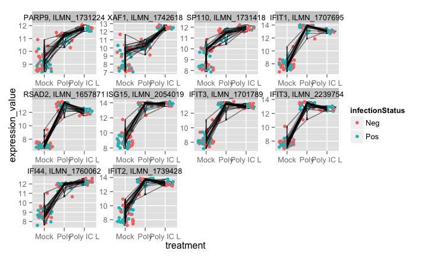

# SISBD: GEO lab
Raphael Gottardo  
 `r Sys.Date()`  

## Setting up some options

Let's first turn on the cache for increased performance and improved styling

```r
# Set some global knitr options
library("knitr")
opts_chunk$set(cache = FALSE, messages = FALSE)
```

Load the `pander` package so we can make nicer table listings with `pandoc.table`.


```r
suppressMessages(library(pander))
```

## Preparation

We will need to query the GEOmetadb database. Today we will explore this 
database and practice various ways to query it.

## Load the `GEOmetadb` package

First we load the `GEOmetadb` library.


```r
suppressMessages(library(GEOmetadb))
```

Let's also view the available objects.


```r
ls("package:GEOmetadb")
```

```
## [1] "columnDescriptions" "geoConvert"         "getBiocPlatformMap"
## [4] "getSQLiteFile"
```

## Download the GEO database

We should have already downloaded this database when viewing the lecture slides.


```r
## This will download the entire database, so can be slow
if (!file.exists("GEOmetadb.sqlite"))
{
  # Download database only if it's not done already
  getSQLiteFile()
}
```

## List tables with `SQL`

In `SQL`, you can query the database structure with ordinary `SQL` commands.


```r
geo_con <- dbConnect(SQLite(), 'GEOmetadb.sqlite')
dbGetQuery(geo_con, "SELECT name FROM sqlite_master WHERE type='table';")
```

```
##                 name
## 1                gse
## 2                gpl
## 3                gsm
## 4            gse_gsm
## 5            gse_gpl
## 6                gds
## 7         gds_subset
## 8            sMatrix
## 9  geodb_column_desc
## 10        geoConvert
## 11          metaInfo
```

## List `gse` fields with `SQL`

The `PRAGMA` command is a standard `SQLite` command.


```r
dbGetQuery(geo_con, "PRAGMA table_info(gse);")
```

```
##    cid                 name    type notnull dflt_value pk
## 1    0                   ID    REAL       0       <NA>  0
## 2    1                title    TEXT       0       <NA>  0
## 3    2                  gse    TEXT       0       <NA>  0
## 4    3               status    TEXT       0       <NA>  0
## 5    4      submission_date    TEXT       0       <NA>  0
## 6    5     last_update_date    TEXT       0       <NA>  0
## 7    6            pubmed_id INTEGER       0       <NA>  0
## 8    7              summary    TEXT       0       <NA>  0
## 9    8                 type    TEXT       0       <NA>  0
## 10   9          contributor    TEXT       0       <NA>  0
## 11  10             web_link    TEXT       0       <NA>  0
## 12  11       overall_design    TEXT       0       <NA>  0
## 13  12              repeats    TEXT       0       <NA>  0
## 14  13  repeats_sample_list    TEXT       0       <NA>  0
## 15  14             variable    TEXT       0       <NA>  0
## 16  15 variable_description    TEXT       0       <NA>  0
## 17  16              contact    TEXT       0       <NA>  0
## 18  17   supplementary_file    TEXT       0       <NA>  0
```

## List tables with `dbListTables`

Instead of using `SQL` commands, we can list tables and fields with functions
from the `GEOmetadb` package.


```r
geo_con <- dbConnect(SQLite(), 'GEOmetadb.sqlite')
dbListTables(geo_con)
```

```
##  [1] "gds"               "gds_subset"        "geoConvert"       
##  [4] "geodb_column_desc" "gpl"               "gse"              
##  [7] "gse_gpl"           "gse_gsm"           "gsm"              
## [10] "metaInfo"          "sMatrix"
```


```r
dbListFields(geo_con, 'gse')
```

```
##  [1] "ID"                   "title"                "gse"                 
##  [4] "status"               "submission_date"      "last_update_date"    
##  [7] "pubmed_id"            "summary"              "type"                
## [10] "contributor"          "web_link"             "overall_design"      
## [13] "repeats"              "repeats_sample_list"  "variable"            
## [16] "variable_description" "contact"              "supplementary_file"
```

## Explore `gse`


```r
columnDescriptions()[1:5,]
```

```
##   TableName        FieldName
## 1       gse            title
## 2       gse              gse
## 3       gse           status
## 4       gse  submission_date
## 5       gse last_update_date
##                                                Description
## 1                 unique name describing the overall study
## 2 unique accession number approved and issued by GEO, NCBI
## 3                                  date released to public
## 4                                           date submitted
## 5                                        date last updated
```

## Load library `data.table`

This will provide us with some practice querying with data.table.


```r
suppressMessages(library(data.table))
```

## Explore `gse` with `data.table`


```r
cd <- as.data.table(columnDescriptions())
cd[TableName == "gse", FieldName]
```

```
##  [1] "title"                "gse"                  "status"              
##  [4] "submission_date"      "last_update_date"     "pubmed_id"           
##  [7] "summary"              "type"                 "contributor"         
## [10] "contact"              "web_link"             "overall_design"      
## [13] "repeats"              "repeats_sample_list"  "variable"            
## [16] "variable_description" "supplementary_file"
```

## List `gse` columns with `pandoc.table`


```r
gsefields <- as.data.frame(
    cd[TableName == "gse" & 
           FieldName %in% c("gse","title","pubmed_id","summary","contact")])
pandoc.table(gsefields, style = "grid")
```

```
## 
## 
## +-------------+-------------+--------------------------------+
## |  TableName  |  FieldName  |          Description           |
## +=============+=============+================================+
## |     gse     |    title    |   unique name describing the   |
## |             |             |         overall study          |
## +-------------+-------------+--------------------------------+
## |     gse     |     gse     |    unique accession number     |
## |             |             |  approved and issued by GEO,   |
## |             |             |              NCBI              |
## +-------------+-------------+--------------------------------+
## |     gse     |  pubmed_id  |  [Values separated by ';tab',  |
## |             |             | if more than one] NCBI PubMed  |
## |             |             |       identifier (PMID)        |
## +-------------+-------------+--------------------------------+
## |     gse     |   summary   | a description of the goals and |
## |             |             |    objectives of this study    |
## +-------------+-------------+--------------------------------+
## |     gse     |   contact   |  contact information for this  |
## |             |             |             study              |
## +-------------+-------------+--------------------------------+
```

## Explore `gpl`


```r
cd[TableName == "gpl", FieldName]
```

```
##  [1] "ID"                   "title"                "gpl"                 
##  [4] "status"               "submission_date"      "last_update_date"    
##  [7] "technology"           "distribution"         "organism"            
## [10] "manufacturer"         "manufacture_protocol" "coating"             
## [13] "catalog_number"       "support"              "description"         
## [16] "web_link"             "contact"              "data_row_count"      
## [19] "supplementary_file"   "bioc_package"
```

## Explore columns in `gpl`


```r
gplfields <- as.data.frame(
    cd[TableName == "gpl" & 
           FieldName %in% c("gpl", "organism", "manufacturer")])
pandoc.table(gplfields, style = "grid")
```

```
## 
## 
## +-------------+--------------+-------------------------------+
## |  TableName  |  FieldName   |          Description          |
## +=============+==============+===============================+
## |     gpl     |     gpl      | unique GEO Platfrom accession |
## |             |              | number approved and issued by |
## |             |              |           GEO, NCBI           |
## +-------------+--------------+-------------------------------+
## |     gpl     |   organism   | [Values separated by ';tab',  |
## |             |              | if more than one] Organism(s) |
## +-------------+--------------+-------------------------------+
## |     gpl     | manufacturer | name of the company, facility |
## |             |              | or laboratory where the array |
## |             |              | was manufactured or produced  |
## +-------------+--------------+-------------------------------+
```

## Explore `gse_gpl`


```r
cd[TableName == "gse_gpl", FieldName]
```

```
## [1] "gse" "gpl"
```

## Explore columns in `gse_gpl`

Why are there only two fields in this table? What is this table for?


```r
gse_gplfields <- as.data.frame(cd[TableName == "gse_gpl"])
pandoc.table(gse_gplfields, style = "grid")
```

```
## 
## 
## +-------------+-------------+-------------------+
## |  TableName  |  FieldName  |    Description    |
## +=============+=============+===================+
## |   gse_gpl   |     gse     |  GEO Series name  |
## +-------------+-------------+-------------------+
## |   gse_gpl   |     gpl     | GEO Platform name |
## +-------------+-------------+-------------------+
```

## List "title" fields with `pandoc.table`

Why do many tables include a "title" field? Are the titles the same?


```r
gsefields <- as.data.frame(
    cd[FieldName == "title"])
pandoc.table(gsefields, style = "grid")
```

```
## 
## 
## +-------------+-------------+-----------------------------+
## |  TableName  |  FieldName  |         Description         |
## +=============+=============+=============================+
## |     gse     |    title    | unique name describing the  |
## |             |             |        overall study        |
## +-------------+-------------+-----------------------------+
## |     gpl     |    title    | unique name describing the  |
## |             |             |       Platform (GPL)        |
## +-------------+-------------+-----------------------------+
## |     gsm     |    title    | unique name describing this |
## |             |             |           Sample            |
## +-------------+-------------+-----------------------------+
## |     gds     |    title    |      title of this GDS      |
## +-------------+-------------+-----------------------------+
```

## List "contact" field structure

Let's look at some records in `gse`. What does a "contact" look like?


```r
query <- "SELECT contact FROM gse LIMIT 1;"
res <- dbGetQuery(geo_con, query)
strsplit(res$contact, '\t')
```

```
## [[1]]
##  [1] "Name: Michael Bittner;"                                                     
##  [2] "Email: mbittner@nhgri.nih.gov;"                                             
##  [3] "Phone: 301-496-7980;"                                                       
##  [4] "Fax: 301-402-3241;"                                                         
##  [5] "Department: Cancer Genetics Branch;"                                        
##  [6] "Institute: NHGRI, NIH;"                                                     
##  [7] "Address:  ;"                                                                
##  [8] "City: Bethesda;"                                                            
##  [9] "State: MD;"                                                                 
## [10] "Zip/postal_code: 20892;"                                                    
## [11] "Country: USA;"                                                              
## [12] "Web_link: http://www.nhgri.nih.gov/Intramural_research/People/bittnerm.html"
```

## Find manufacturer data

Query the manufacturers with a `SQL` command, listed with `data.table`...


```r
manu <- data.table(dbGetQuery(geo_con, 
    "SELECT DISTINCT manufacturer FROM gpl ORDER BY manufacturer ASC;"))
manu[,list(length(manufacturer)), by = manufacturer]
```

```
##                                         manufacturer V1
##    1:                                             NA  1
##    2:                                              -  1
##    3:                                              .  1
##    4:                                            454  1
##    5:                              454 Life Sciences  1
##   ---                                                  
## 2102: washington university microarray core facility  1
## 2103:         www.MYcroarray.com, Ann Arbor, MI, USA  1
## 2104:                                www.agilent.com  1
## 2105:                           www.chem.agilent.com  1
## 2106:                            www.combimatrix.com  1
```

## Our `SQL` command

We just wanted a list of manufacturers so the `SQL` query is:

```
SELECT DISTINCT manufacturer FROM gpl 
ORDER BY manufacturer ASC;
```

However, since we also grouped `by=manufacturer` in our `data.table`, we could 
have simply used the `SQL` query:

```
SELECT manufacturer FROM gpl;
```

Let's try that...

## Find manufacturer data

Query the manufacturers with a simpler `SQL` command ... grouping with `by` and 
ordering with `setkey` in `data.table`...


```r
manu <- data.table(dbGetQuery(geo_con, 
            "SELECT manufacturer FROM gpl;"))
setkey(manu, manufacturer)
manu[, list(length(manufacturer)), by = manufacturer]
```

```
##                                         manufacturer V1
##    1:                                             NA  1
##    2:                                              -  1
##    3:                                              .  1
##    4:                                            454  1
##    5:                              454 Life Sciences  1
##   ---                                                  
## 2102: washington university microarray core facility  1
## 2103:         www.MYcroarray.com, Ann Arbor, MI, USA  1
## 2104:                                www.agilent.com  1
## 2105:                           www.chem.agilent.com  1
## 2106:                            www.combimatrix.com  1
```


## Finding data with a `join`

To get supplementary file names ending with `CEL.gz` (case-insensitive) from 
only manufacturer Affymetrix, we need to `join` the `gsm` and `gpl` tables. 

```
SELECT 
        gpl.bioc_package, 
        gsm.title, 
        gsm.series_id, 
        gsm.gpl, 
        gsm.supplementary_file 
    FROM gsm 
    JOIN gpl ON gsm.gpl=gpl.gpl 
    WHERE gpl.manufacturer='Affymetrix' 
        AND gsm.supplementary_file like '%CEL.gz';
```

## Now let's run that query


```r
query <- "SELECT 
            gpl.bioc_package, 
            gsm.title, 
            gsm.series_id, 
            gsm.gpl, 
            gsm.supplementary_file 
        FROM gsm 
        JOIN gpl ON gsm.gpl=gpl.gpl 
        WHERE gpl.manufacturer='Affymetrix' 
            AND gsm.supplementary_file like '%CEL.gz';"
res <- dbGetQuery(geo_con, query)
head(res, 3)
```

```
##   bioc_package      title series_id   gpl
## 1       hu6800 BM_CD34-1a    GSE500 GPL80
## 2       hu6800 BM_CD34-1b    GSE500 GPL80
## 3       hu6800  BM_CD34-2    GSE500 GPL80
##                                                         supplementary_file
## 1 ftp://ftp.ncbi.nlm.nih.gov/geo/samples/GSMnnn/GSM575/suppl/GSM575.cel.gz
## 2 ftp://ftp.ncbi.nlm.nih.gov/geo/samples/GSMnnn/GSM576/suppl/GSM576.cel.gz
## 3 ftp://ftp.ncbi.nlm.nih.gov/geo/samples/GSMnnn/GSM577/suppl/GSM577.cel.gz
```

## Why did we need a `join`?

The 
[GEOmetadb database](http://gbnci.abcc.ncifcrf.gov/geo/geo_help.php), 
is a [relational database](http://en.wikipedia.org/wiki/Relational_database). 

There are several tables which can be linked on common fields. 

Since each table 
contains data for only one type of record, tables must be linked to search for 
fields pertaining to the various types of records. 

We join on the common fields, 
called [keys](http://en.wikipedia.org/wiki/Relational_database#Primary_key).

## Table Relationships of `GEOmetadb`


Source: [Help: GEOmetadb Application, Meltzerlab/GB/CCR/NCI/NIH &copy;2008](http://gbnci.abcc.ncifcrf.gov/geo/geo_help.php)

## Keys of `GEOmetadb`

```
+------------+-------+------------------------------------------------+
| Table      | Key   | Links to Table.Key                             |
+============+=======+================================================+
| gse        | gse   | gse_gpl.gse, gse_gsm.gse, gds.gse, sMatrix.gse |
+------------+-------+------------------------------------------------+
| gpl        | gpl   | gds.gpl, gse_gpl.gpl, sMatrix.gpl, gsm.gpl     |
+------------+-------+------------------------------------------------+
| gsm        | gsm   | gse_gsm.gsm                                    |
| gsm        | gpl   | gds.gpl, gse_gpl.gpl, sMatrix.gpl, gpl.gpl     |
+------------+-------+------------------------------------------------+
| gds        | gds   | gds_subset.gds                                 |
+------------+-------+------------------------------------------------+
| gds_subset | gds   | gds.gds                                        |
+------------+-------+------------------------------------------------+
| sMatrix    | gse   | gse_gpl.gse, gse_gsm.gse, gds.gse, gse.gse     |
| sMatrix    | gpl   | gds.gpl, gse_gpl.gpl, gpl.gpl, gsm.gpl         |
+------------+-------+------------------------------------------------+
| gse_gpl    | gse   | gse_gpl.gse, gse_gsm.gse, gds.gse, sMatrix.gse |
| gse_gpl    | gpl   | gds.gpl, gse_gpl.gpl, gpl.gpl, sMatrix.gpl     |
+------------+-------+------------------------------------------------+
| gse_gsm    | gse   | gse_gpl.gse, gse.gse, gds.gse, sMatrix.gse     |
| gse_gsm    | gsm   | gsm.gsm                                        |
+------------+-------+------------------------------------------------+
```

Source: [Help: GEOmetadb Application, Meltzerlab/GB/CCR/NCI/NIH &copy;2008](http://gbnci.abcc.ncifcrf.gov/geo/geo_help.php)

## A three-table `join`

To get raw data, we need to `join` three tables with two `join` clauses. The first
`join` is a subquery in the `from` clause, using `gse_gsm` to find `gsm` records
corresponding to `gse` records. We then `join` this with `gsm` for those records. 
This approach works well when you only have a few queries to make or you have 
limited memory (RAM) available.


```r
query <- "SELECT gsm.gsm, gsm.supplementary_file 
        FROM (gse JOIN gse_gsm ON gse.gse=gse_gsm.gse) j 
        JOIN gsm ON j.gsm=gsm.gsm 
        WHERE gse.pubmed_id='21743478' 
        LIMIT 2;"
res <- as.data.table(dbGetQuery(geo_con, query))
res[, strsplit(gsm.supplementary_file, ';\t'), by = gsm.gsm]
```

```
##      gsm.gsm
## 1: GSM733816
## 2: GSM733816
## 3: GSM733817
## 4: GSM733817
##                                                                                   V1
## 1: ftp://ftp.ncbi.nlm.nih.gov/geo/samples/GSM733nnn/GSM733816/suppl/GSM733816.CEL.gz
## 2: ftp://ftp.ncbi.nlm.nih.gov/geo/samples/GSM733nnn/GSM733816/suppl/GSM733816.chp.gz
## 3: ftp://ftp.ncbi.nlm.nih.gov/geo/samples/GSM733nnn/GSM733817/suppl/GSM733817.CEL.gz
## 4: ftp://ftp.ncbi.nlm.nih.gov/geo/samples/GSM733nnn/GSM733817/suppl/GSM733817.chp.gz
```

## Joins in `data.table`

We can repeat the same operation using `data.table`, once we have converted the 
GEO tables to `data.table`s and set their keys. The homework assignment asks 
that you try to fit the `data.table` manipulations (merge, subset, etc.) into 
a single line. This approach will allow us to do additional fast joins later, 
since the tables are now in memory (RAM).


```r
gseDT <- data.table(dbGetQuery(geo_con, "SELECT * from gse;"), key = "gse")
gsmDT <- data.table(dbGetQuery(geo_con, "SELECT * from gsm;"), key = "gsm")
gse_gsmDT <- data.table(dbGetQuery(geo_con, "SELECT * from gse_gsm;"), 
    key = c("gse", "gsm"))
gsmDT[gse_gsmDT[gseDT[pubmed_id == 21743478, gse], gsm, nomatch = 0], nomatch = 0][1:2, list(gsm, supplementary_file)][,strsplit(supplementary_file, ';\t'), by = gsm]
```

```
##          gsm
## 1: GSM733816
## 2: GSM733816
## 3: GSM733817
## 4: GSM733817
##                                                                                   V1
## 1: ftp://ftp.ncbi.nlm.nih.gov/geo/samples/GSM733nnn/GSM733816/suppl/GSM733816.CEL.gz
## 2: ftp://ftp.ncbi.nlm.nih.gov/geo/samples/GSM733nnn/GSM733816/suppl/GSM733816.chp.gz
## 3: ftp://ftp.ncbi.nlm.nih.gov/geo/samples/GSM733nnn/GSM733817/suppl/GSM733817.CEL.gz
## 4: ftp://ftp.ncbi.nlm.nih.gov/geo/samples/GSM733nnn/GSM733817/suppl/GSM733817.chp.gz
```

## All in one line?

Can we do it all in one line of code? Yes, but it's ugly and hard to follow, 
even with line-wrap. Plus, additional queries will have to reload the data from 
the database. Yuk! (Don't do it this way.)


```r
data.table(dbGetQuery(geo_con, 
    "SELECT * from gsm;"), key = "gsm")[data.table(dbGetQuery(geo_con, 
    "SELECT * from gse_gsm;"), key = c("gse", "gsm"))[data.table(dbGetQuery(geo_con, 
    "SELECT * from gse;"), key = "gse")[pubmed_id == 21743478, gse], gsm, 
    nomatch = 0], nomatch = 0][1:2, list(gsm, supplementary_file)][,
    strsplit(supplementary_file, ';\t'), by = gsm]
```

```
##          gsm
## 1: GSM733816
## 2: GSM733816
## 3: GSM733817
## 4: GSM733817
##                                                                                   V1
## 1: ftp://ftp.ncbi.nlm.nih.gov/geo/samples/GSM733nnn/GSM733816/suppl/GSM733816.CEL.gz
## 2: ftp://ftp.ncbi.nlm.nih.gov/geo/samples/GSM733nnn/GSM733816/suppl/GSM733816.chp.gz
## 3: ftp://ftp.ncbi.nlm.nih.gov/geo/samples/GSM733nnn/GSM733817/suppl/GSM733817.CEL.gz
## 4: ftp://ftp.ncbi.nlm.nih.gov/geo/samples/GSM733nnn/GSM733817/suppl/GSM733817.chp.gz
```

## Joining with `merge`

Some people like to use the familiar `merge`. There is a version of `merge`
built into `data.table` for improved performance. We will use the three DTs we 
made previously. To remove duplicates, we use `unique`. (Why are there duplicates?)


```r
unique(merge(gsmDT[,list(gsm,supplementary_file)], 
      merge(gseDT[pubmed_id == 21743478, list(gse)], 
            gse_gsmDT)[,list(gsm)])[1:4, list(gsm, supplementary_file)])[,
                    strsplit(supplementary_file, ';\t'), by = gsm]
```

```
##          gsm
## 1: GSM733816
## 2: GSM733816
## 3: GSM733817
## 4: GSM733817
##                                                                                   V1
## 1: ftp://ftp.ncbi.nlm.nih.gov/geo/samples/GSM733nnn/GSM733816/suppl/GSM733816.CEL.gz
## 2: ftp://ftp.ncbi.nlm.nih.gov/geo/samples/GSM733nnn/GSM733816/suppl/GSM733816.chp.gz
## 3: ftp://ftp.ncbi.nlm.nih.gov/geo/samples/GSM733nnn/GSM733817/suppl/GSM733817.CEL.gz
## 4: ftp://ftp.ncbi.nlm.nih.gov/geo/samples/GSM733nnn/GSM733817/suppl/GSM733817.chp.gz
```

## Joining with `merge` and `magrittr`

We can also use `%>%` from `magrittr` to improve readability, again using the 
three DTs we made previously. Here we will use two "lines" of code.


```r
library(magrittr)
mergedDT <- unique(gseDT[pubmed_id == 21743478, list(gse)] %>% 
                merge(y = gse_gsmDT, by = c("gse")) %>% 
                merge(y = gsmDT[,list(gsm,supplementary_file)], by = c("gsm")))
mergedDT[1:2, list(gsm, gse, supplementary_file)][,
                strsplit(supplementary_file, ';\t'), by = gsm]
```

```
##          gsm
## 1: GSM733816
## 2: GSM733816
## 3: GSM733817
## 4: GSM733817
##                                                                                   V1
## 1: ftp://ftp.ncbi.nlm.nih.gov/geo/samples/GSM733nnn/GSM733816/suppl/GSM733816.CEL.gz
## 2: ftp://ftp.ncbi.nlm.nih.gov/geo/samples/GSM733nnn/GSM733816/suppl/GSM733816.chp.gz
## 3: ftp://ftp.ncbi.nlm.nih.gov/geo/samples/GSM733nnn/GSM733817/suppl/GSM733817.CEL.gz
## 4: ftp://ftp.ncbi.nlm.nih.gov/geo/samples/GSM733nnn/GSM733817/suppl/GSM733817.chp.gz
```

## Only get what you need

It makes sense to only `select` the data we need from the SQL database. Why pull 
in extra data, only to ignore it? We will still use `data.table` for the `join`, 
though, in keeping with the spirit of the assignment.


```r
gseDT <- data.table(dbGetQuery(geo_con, 
    "SELECT gse from gse WHERE pubmed_id = '21743478';"), key = "gse")
gsmDT <- data.table(dbGetQuery(geo_con, 
    "SELECT gsm, supplementary_file from gsm;"), key = "gsm")
gse_gsmDT <- data.table(dbGetQuery(geo_con, 
    "SELECT * from gse_gsm;"), key = c("gse", "gsm"))
gsmDT[gse_gsmDT[gseDT, gsm, nomatch = 0], nomatch = 0][1:2, 
    list(gsm, supplementary_file)][,strsplit(supplementary_file, ';\t'), by = gsm]
```

```
##          gsm
## 1: GSM733816
## 2: GSM733816
## 3: GSM733817
## 4: GSM733817
##                                                                                   V1
## 1: ftp://ftp.ncbi.nlm.nih.gov/geo/samples/GSM733nnn/GSM733816/suppl/GSM733816.CEL.gz
## 2: ftp://ftp.ncbi.nlm.nih.gov/geo/samples/GSM733nnn/GSM733816/suppl/GSM733816.chp.gz
## 3: ftp://ftp.ncbi.nlm.nih.gov/geo/samples/GSM733nnn/GSM733817/suppl/GSM733817.CEL.gz
## 4: ftp://ftp.ncbi.nlm.nih.gov/geo/samples/GSM733nnn/GSM733817/suppl/GSM733817.chp.gz
```

## Cleanup


```r
dbDisconnect(geo_con)
```

```
## [1] TRUE
```

## Time for you to work!

1. Use the `GEOmetabd` package to find all HCV gene expression data using the Illumina platform submitted by an investigator at Yale. This should be done with a single query, showing the title, the GSE accession number, the GPL accession number and the manufacturer and the description of the platform used.

2. Reproduce your above query using the data.table package. Again, try to use a single line of code. [Hint: You first need to convert all db tables to data.table tables].


# Solution

## Let's create a new connection


```r
con <- dbConnect(SQLite(),'GEOmetadb.sqlite')
```

## Using SQL


```r
res <- dbGetQuery(con, "SELECT gse.title, gse.gse, gpl.gpl, gpl.manufacturer, gpl.title
                  FROM (gse JOIN gse_gpl ON gse.gse=gse_gpl.gse) j
                  JOIN gpl on j.gpl=gpl.gpl 
                  WHERE gpl.manufacturer like '%Illumina%'
                  AND gse.contact like '%Yale%'
                  AND (gse.title like '%epatit%' OR gse.title like '%HCV%'); ")
```

## Using data.table


```r
gse <- data.table(dbGetQuery(con, "SELECT gse.title, gse.gse, gse.contact FROM gse"), key = "gse")
gpl <- data.table(dbGetQuery(con, "SELECT gpl.gpl, gpl.manufacturer, gpl.description FROM gpl"), key = "gpl")
gse_gpl <- data.table(dbGetQuery(con, "SELECT gse_gpl.gse, gse_gpl.gpl FROM gse_gpl"), key = "gse")

res2 <- merge(gse[gse_gpl, nomatch = 0], gpl, by = "gpl")[title %like% "HCV" 
                                                          & contact %like% "Yale" & manufacturer %like% "Illumina"]
```

## Now what?

We have identifed the data we want, let's download them


```r
gds <- getGEO("GSE40812", destdir = "data/geo/")[[1]]
```

```
## ftp://ftp.ncbi.nlm.nih.gov/geo/series/GSE40nnn/GSE40812/matrix/
## Found 1 file(s)
## GSE40812_series_matrix.txt.gz
## Using locally cached version: data/geo//GSE40812_series_matrix.txt.gz
## Using locally cached version of GPL10558 found here:
## data/geo//GPL10558.soft
```

```r
pData(gds)[1:2,]
```

```
##                                   title geo_accession
## GSM1002366      RM1_2046_Neg_Mock_MACRO    GSM1002366
## GSM1002367 RM2_2046_Neg_Poly IC H_MACRO    GSM1002367
##                           status submission_date last_update_date type
## GSM1002366 Public on Mar 05 2013     Sep 12 2012      Mar 05 2013  RNA
## GSM1002367 Public on Mar 05 2013     Sep 12 2012      Mar 05 2013  RNA
##            channel_count             source_name_ch1 organism_ch1
## GSM1002366             1 Monocyte-derived Macrophage Homo sapiens
## GSM1002367             1 Monocyte-derived Macrophage Homo sapiens
##              characteristics_ch1                  characteristics_ch1.1
## GSM1002366 infection status: Neg cell type: Monocyte-derived Macrophage
## GSM1002367 infection status: Neg cell type: Monocyte-derived Macrophage
##            characteristics_ch1.2 molecule_ch1
## GSM1002366       treatment: Mock    total RNA
## GSM1002367  treatment: Poly IC H    total RNA
##                                                                                                                         extract_protocol_ch1
## GSM1002366 Total RNA from paired macrophage and PBMC samples from VL- and VL+ subjects was extracted using the RNeasy mini kit (Qiagen, CA).
## GSM1002367 Total RNA from paired macrophage and PBMC samples from VL- and VL+ subjects was extracted using the RNeasy mini kit (Qiagen, CA).
##            label_ch1
## GSM1002366    biotin
## GSM1002367    biotin
##                                                                                                                                 label_protocol_ch1
## GSM1002366 Preparation of cDNA, cRNA, and labeling were carried out by the Yale Center for Genomic Analysis using the standard Illumina protocols.
## GSM1002367 Preparation of cDNA, cRNA, and labeling were carried out by the Yale Center for Genomic Analysis using the standard Illumina protocols.
##            taxid_ch1
## GSM1002366      9606
## GSM1002367      9606
##                                                                                                                                                                                             hyb_protocol
## GSM1002366 1.5 µg of cRNA was combined with hybridization controls and hybridized to the array for 16 hours in a hybridization oven at 58°C. The chip was then washed and stained with streptavidin-Cy3.
## GSM1002367 1.5 µg of cRNA was combined with hybridization controls and hybridized to the array for 16 hours in a hybridization oven at 58°C. The chip was then washed and stained with streptavidin-Cy3.
##                                                         scan_protocol
## GSM1002366 The array was scanned using the Illumina BeadArray reader.
## GSM1002367 The array was scanned using the Illumina BeadArray reader.
##                                                                                  description
## GSM1002366      Primary Monocyte-derived Macrophages from HCV-negative patient, Mock-treated
## GSM1002367 Primary Monocyte-derived Macrophages from HCV-negative patient, Poly IC H-treated
##                                                                                                                                                                          data_processing
## GSM1002366 Microarray data from the validation cohort underwent quantile normalization using the lumi package in bioconductor [R version 2.13.2, Lumi version 2.4, Limma version 3.8.3].
## GSM1002367 Microarray data from the validation cohort underwent quantile normalization using the lumi package in bioconductor [R version 2.13.2, Lumi version 2.4, Limma version 3.8.3].
##            platform_id      contact_name            contact_email
## GSM1002366    GPL10558 Ruth,R,Montgomery ruth.montgomery@yale.edu
## GSM1002367    GPL10558 Ruth,R,Montgomery ruth.montgomery@yale.edu
##            contact_department                  contact_institute
## GSM1002366  Internal Medicine Yale University School of Medicine
## GSM1002367  Internal Medicine Yale University School of Medicine
##            contact_address contact_city contact_state
## GSM1002366   300 Cedar St.    New Haven            CT
## GSM1002367   300 Cedar St.    New Haven            CT
##            contact_zip/postal_code contact_country supplementary_file
## GSM1002366                   06520             USA               NONE
## GSM1002367                   06520             USA               NONE
##            data_row_count
## GSM1002366          47323
## GSM1002367          47323
```

## Sanitize our data


```r
sanitize_pdata <- function(pd) {
keepCols <- c("title", "source_name_ch1", "characteristics_ch1", "characteristics_ch1.2")
pd <- pd[, keepCols]
colnames(pd) <- c("ptid", "cellType", "infectionStatus", "treatment")

pd$ptid <- sapply(pd$ptid, FUN = function(x) {unlist(strsplit(as.character(x), "_"))[2]}) 
pd$infectionStatus <- gsub(".*: ", "", pd$infectionStatus) 
pd$treatment <- gsub(".*: ", "", pd$treatment)
pd$treatment <- gsub("Poly IC H", "Poly", pd$treatment)
pd
}
```

## Sanityze and select data

We will select the macrophage data as in the paper (Figure 2).

```r
gds_new <- gds
pData(gds_new) <- sanitize_pdata(pData(gds_new))
macrophageData <- gds_new[, pData(gds_new)$cellType == "Monocyte-derived Macrophage"]
```

## Look for differentially expressed genes upon stimulation


```r
# Load the limma package
suppressMessages(library(limma))

# Set up design matrix
mm1 <- model.matrix(~treatment + ptid, macrophageData)
fit1 <- lmFit(macrophageData, mm1)
ebay1 <- eBayes(fit1)

# Select differentially expressed genes
# According to the paper: Poly(IC) response signatures were generated based on FC >= 1.5 relative to Mock, statistically significant change in exp as determined by limma (BH FDR <0.05)
# BH is default
tt1 <- topTable(ebay1, coef = "treatmentPoly", number = 10,  p.value = 0.01, lfc = log2(1.5), sort.by = "p")
```

## EDA of differentially expressed genes

Let's get our data ready


```r
fd <- data.table(fData(gds_new), keep.rownames = TRUE)
setnames(fd, "rn", "probe_name")
pd <- data.table(pData(gds_new), keep.rownames = TRUE)
setnames(pd, "rn", "filename")
ed <- data.table(t(exprs(gds_new)), keep.rownames = TRUE)
setnames(ed, "rn", "filename")
setkey(pd, filename)
setkey(ed, filename)
md <- ed[pd]
```

## Reshaping data


```r
library(reshape2)
md_long <- melt(md, variable.name = "probe_name", value.name = "expression_value")
```

```
## Warning in melt.data.table(md, variable.name = "probe_name", value.name
## = "expression_value"): To be consistent with reshape2's melt, id.vars and
## measure.vars are internally guessed when both are 'NULL'. All non-numeric/
## integer/logical type columns are conisdered id.vars, which in this case are
## columns 'filename, ptid, cellType, infectionStatus, treatment'. Consider
## providing at least one of 'id' or 'measure' vars in future.
```

```r
# Add gene variance
md_long[, sd_probe := sd(expression_value), by = probe_name]
```

```
##            filename ptid                    cellType infectionStatus
##       1: GSM1002366 2046 Monocyte-derived Macrophage             Neg
##       2: GSM1002367 2046 Monocyte-derived Macrophage             Neg
##       3: GSM1002368 3049 Monocyte-derived Macrophage             Pos
##       4: GSM1002369 3050 Monocyte-derived Macrophage             Pos
##       5: GSM1002370 3049 Monocyte-derived Macrophage             Pos
##      ---                                                            
## 3785836: GSM1002441 3057                        PBMC             Pos
## 3785837: GSM1002442 3058                        PBMC             Pos
## 3785838: GSM1002443 3059                        PBMC             Pos
## 3785839: GSM1002444 3058                        PBMC             Pos
## 3785840: GSM1002445 3059                        PBMC             Pos
##          treatment   probe_name expression_value   sd_probe
##       1:      Mock ILMN_1343291        13.927980 0.14041630
##       2:      Poly ILMN_1343291        13.982486 0.14041630
##       3:      Mock ILMN_1343291        13.842999 0.14041630
##       4:      Mock ILMN_1343291        13.828501 0.14041630
##       5:      Poly ILMN_1343291        13.919500 0.14041630
##      ---                                                   
## 3785836: Poly IC L ILMN_3311190         6.651197 0.09171725
## 3785837:      Mock ILMN_3311190         6.557616 0.09171725
## 3785838:      Mock ILMN_3311190         6.640864 0.09171725
## 3785839: Poly IC L ILMN_3311190         6.618590 0.09171725
## 3785840: Poly IC L ILMN_3311190         6.619133 0.09171725
```

## Filter and join


```r
setkey(md_long, probe_name)
setkey(fd, probe_name)
md_long_short <- fd[md_long[probe_name %in% tt1$Probe_Id] , nomatch = 0]
```


## EDA of DE genes


```r
library(ggplot2)
ggplot(md_long_short, aes(x = treatment, y = expression_value)) + geom_violin() + geom_jitter(aes(color = infectionStatus)) + geom_line(aes(group = ptid), alpha = .5) + facet_wrap( ~Symbol + probe_name, scales = "free")
```

 

**Exercise:** Repeat this with different gene names and geometries


