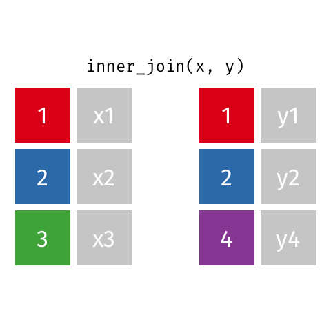

```{r, echo = FALSE, include=FALSE}
library(knitr)
opts_chunk$set(comment = "")
library(tidyverse)
```

## Joining

"Combining datasets"

```{r, fig.alt="Inner, outer, left, and right joins represented with venn diagrams", out.width = "50%", echo = FALSE, align = "center"}

```

## Joining in `dplyr`

* Merging/joining data sets together - usually on key variables, usually "id"
* `?join` - see different types of joining for `dplyr`
* `inner_join(x, y)` - only rows that match for `x` and `y` are kept
* `full_join(x, y)` - all rows of `x` and `y` are kept 
* `left_join(x, y)` - all rows of `x` are kept even if not merged with `y`
* `right_join(x, y)` - all rows of `y` are kept even if not merged with `x`
* `anti_join(x, y)` - all rows from `x` not in `y` keeping just columns from `x`.

## Merging: Simple Data

```{r echo=FALSE}
data_As <- tibble(
  State = c("Alabama", "Alaska"),
  June_vacc_rate = c(0.516, 0.627),
  May_vacc_rate = c(0.514, 0.626)
)
data_cold <- tibble(
  State = c("Maine", "Alaska"),
  April_vacc_rate = c(0.795, 0.623)
)
```

```{r}
data_As
data_cold
```

## Inner Join

https://github.com/gadenbuie/tidyexplain/blob/main/images/inner-join.gif

```{r, fig.alt="A gif showing the inner joining of two simple datasets.", out.width = "40%", echo = FALSE, align = "center"}

```

## Inner Join

```{r inner_join}
ij <- inner_join(data_As, data_cold)
ij
```

## Left Join

https://raw.githubusercontent.com/gadenbuie/tidyexplain/main/images/left-join.gif

```{r, fig.alt="A gif showing the left joining of two simple datasets.", out.width = "40%", echo = FALSE, align = "center"}
knitr::include_graphics("media/Join_left-join.gif")
```

## Left Join

```{r left_join}
lj <- left_join(data_As, data_cold)
lj
```

## Install `tidylog` package to log outputs

```{r, include=FALSE}
# install.packages("tidylog")
library(tidylog)
```

```{r left_join_log}
# install.packages("tidylog")
library(tidylog)
left_join(data_As, data_cold)
```

## Right Join

https://raw.githubusercontent.com/gadenbuie/tidyexplain/main/images/right-join.gif

```{r, fig.alt="A gif showing the right joining of two simple datasets.", out.width = "40%", echo = FALSE, align = "center"}
knitr::include_graphics("media/Join_right-join.gif")
```

## Right Join

```{r right_join}
rj <- right_join(data_As, data_cold)
rj
```

## Left Join: Switching arguments

```{r right_join2}
lj2 <- left_join(data_cold, data_As)
lj2
```

## Full Join

https://raw.githubusercontent.com/gadenbuie/tidyexplain/main/images/full-join.gif

```{r, fig.alt="A gif showing the full joining of two simple datasets.", out.width = "40%", echo = FALSE, align = "center"}
knitr::include_graphics("media/Join_full-join.gif")
```

## Full Join

```{r}
fj <- full_join(data_As, data_cold)
fj
```

## Watch out for "`includes duplicates`"

```{r echo=FALSE}
data_As <- tibble(State = c("Alabama", "Alaska"),
                 state_bird = c("wild turkey", "willow ptarmigan"))
data_cold <- tibble(State = c("Maine", "Alaska", "Alaska"),
                    vacc_rate = c(0.795, 0.623, 0.626),
                    month = c("April", "April", "May"))
```

```{r}
data_As
data_cold
```

## Watch out for "`includes duplicates`"

```{r}
lj <- left_join(data_As, data_cold)
```

## Watch out for "`includes duplicates`"

Data including the joining column ("State") has been duplicated.

```{r}
lj
```

<br>

Note that "Alaska willow ptarmigan" appears twice.

## Watch out for "`includes duplicates`"

https://github.com/gadenbuie/tidyexplain/blob/main/images/left-join-extra.gif

```{r, fig.alt="A gif showing how data can be duplicated from one dataset when joining two simple datasets.", out.width = "40%", echo = FALSE, align = "center"}
knitr::include_graphics("media/Join_left_join_extra.gif")
```

## Stop `tidylog`

```{r}
unloadNamespace("tidylog")
```

## Using the `by` argument

By default joins use the intersection of column names. If `by` is specified, it uses that.

```{r use_by}
full_join(data_As, data_cold, by = "State")
```

## Using the `by` argument

You can join based on multiple columns by using something like `by = c(col1, col2)`.

If the datasets have two different names for the same data, use:

```{r eval=FALSE}
full_join(x, y, by = c("a" = "b"))
```

## Using "`setdiff`" (base)

We might want to determine what indexes ARE in the first dataset that AREN'T in the second:

```{r}
data_As
data_cold
```

## Using "`setdiff`" (base)

Use `setdiff` to determine what indexes ARE in the first dataset that AREN'T in the second:

```{r}
A_states <- data_As %>% pull(State)
cold_states <- data_cold %>% pull(State)
```

```{r}
setdiff(A_states, cold_states)
setdiff(cold_states, A_states)
```

## Using `bind_rows()` (`dplyr`) {.codesmall}

Rows are stacked on top of each other. Works like `rbind()` from base R, but is "smarter" and looks for matching column names. 

```{r error = TRUE}
rbind(data_As, data_cold)
```

```{r}
bind_rows(data_As, data_cold)
```

## Other stuff: `anti_join` (`dplyr`)

```{r}
anti_join(data_As, data_cold)
```

https://raw.githubusercontent.com/gadenbuie/tidyexplain/main/images/anti-join.gif

```{r, fig.alt="A gif showing the full joining of two simple datasets.", out.width = "40%", echo = FALSE, align = "center"}
knitr::include_graphics("media/Join_anti-join.gif")
```

## Other stuff: `cross_join` (`dplyr`)

Cross joins match each row in x to every row in y, resulting in a data frame with nrow(x) * nrow(y) rows.

```{r}
cross_join(data_As, data_cold)
```

## Other stuff: `nest_join` (`dplyr`)

A nest join leaves x almost unchanged, except that it adds a new column for the y dataset. Matched values are stored inside the "cell" as a tibble.

```{r}
nj <- nest_join(data_As, data_cold)
```

```{r}
nj
```

## Other stuff: `nest_join` (`dplyr`)

```{r}
nj %>% pull(data_cold)
```

## Summary

* Merging/joining data sets together - assumes all column names that overlap
     - use the `by = c("a" = "b")` if they differ
* `inner_join(x, y)` - only rows that match for `x` and `y` are kept
* `full_join(x, y)` - all rows of `x` and `y` are kept 
* `left_join(x, y)` - all rows of `x` are kept even if not merged with `y`
* `right_join(x, y)` - all rows of `y` are kept even if not merged with `x`
* Use the `tidylog` package for a detailed summary
* `setdiff(x, y)` shows what in `x` is missing from `y`
* `bind_rows(x, y)` appends datasets

# Extra slides

## "Includes duplicates" with both datasets duplicated: {.codesmall}

```{r}
data_As <- tibble(State = c("Alabama", "Alaska", "Alaska"),
                 state_bird = c("wild turkey", "willow ptarmigan", "puffin"))
data_cold <- tibble(State = c("Maine", "Alaska", "Alaska"),
                    vacc_rate = c("32.4%", "41.7%", "46.2%"),
                    month = c("April", "April", "May"))
```

## "Includes duplicates" with both datasets duplicated: {.codesmall}

```{r}
full_join(data_As, data_cold)
```
