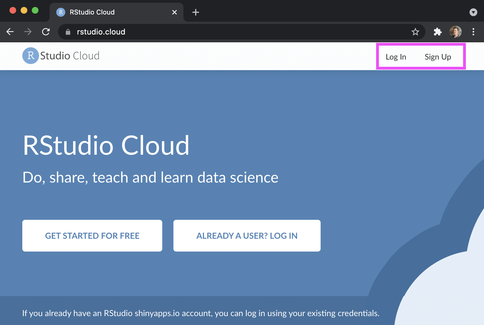
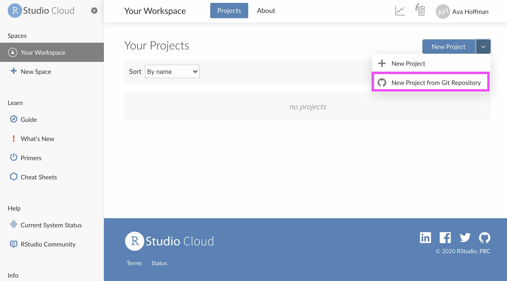
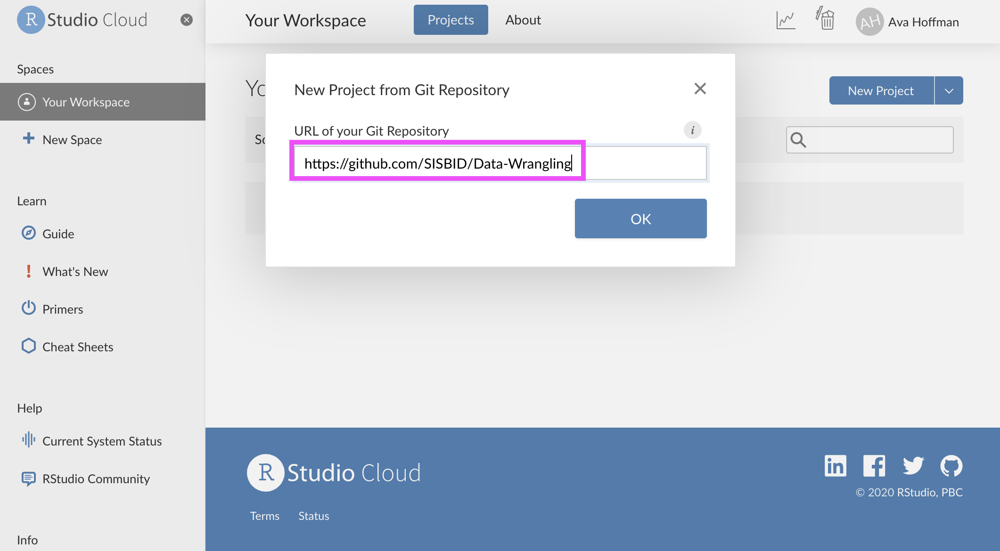
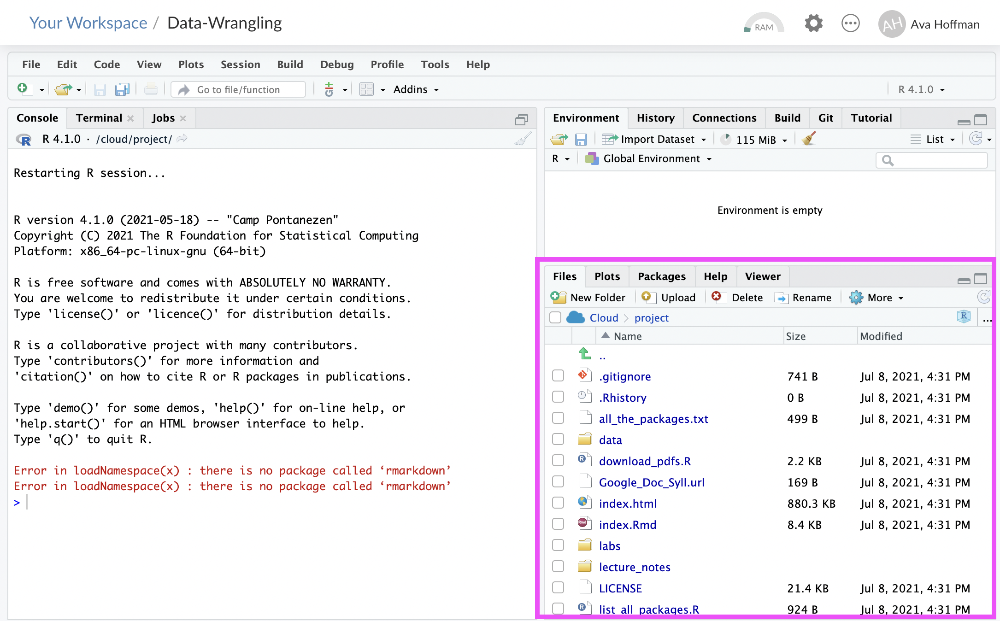

```{r, echo = FALSE, include=FALSE, purl=FALSE}
library(knitr)
opts_chunk$set(comment = "")
```

```{r, include=FALSE}
library(tidyverse)
```

## Setup on RStudio Cloud

1. Sign up for RStudio Cloud or log in using your preferred credentials.

```{r, out.width="100%", echo = FALSE, purl=FALSE}

```

## Setup on RStudio Cloud

2. Once logged in, select the "New Project" dropdown in "Your Workspace" and select "New project from Git Repository".

```{r, out.width="100%", echo = FALSE, purl=FALSE}

```

## Setup on RStudio Cloud

3. Enter the link to the class GitHub repository (https://github.com/SISBID/Data-Wrangling) and click "OK". The project will take a bit of time to deploy.

```{r, out.width="100%", echo = FALSE, purl=FALSE}

```

## Setup on RStudio Cloud

3. You should now see files listed in your workspace (including some datasets we'll be using). Feel free to change any files here - they are yours now! For the most up-to-date versions of files, please visit the website: http://sisbid.github.io/Data-Wrangling/.

```{r, out.width="75%", echo = FALSE, purl=FALSE}

```
