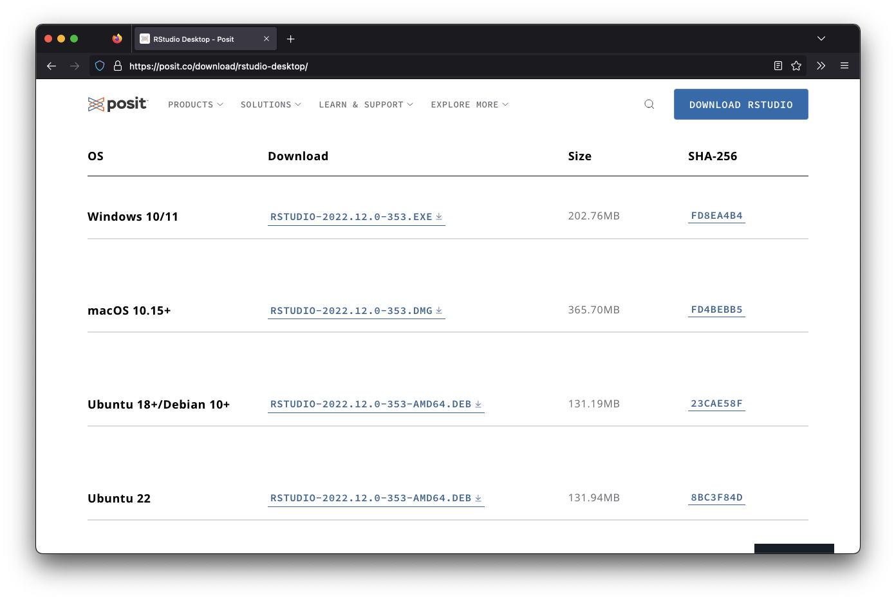
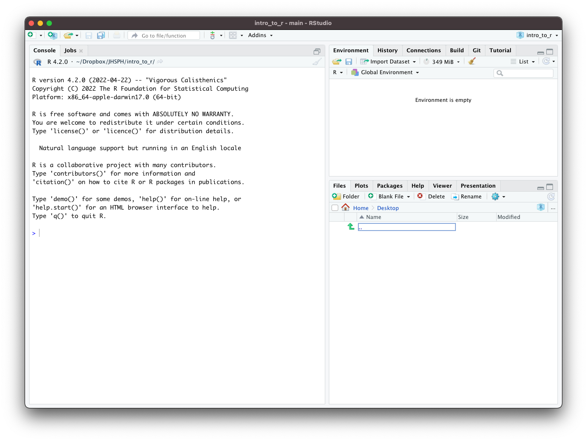
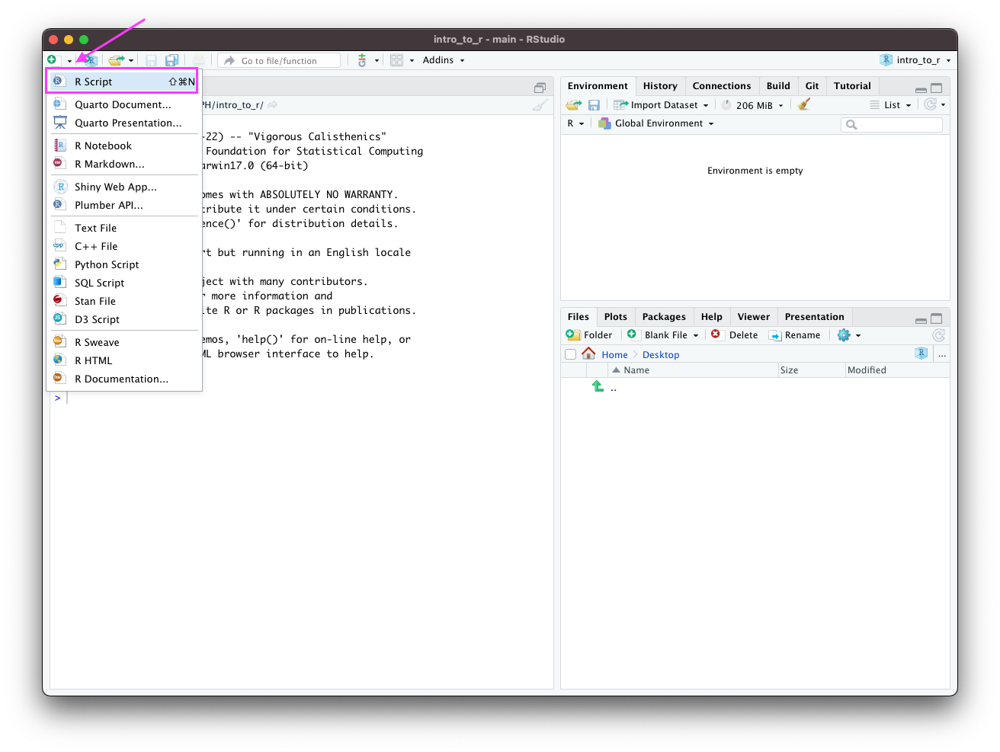
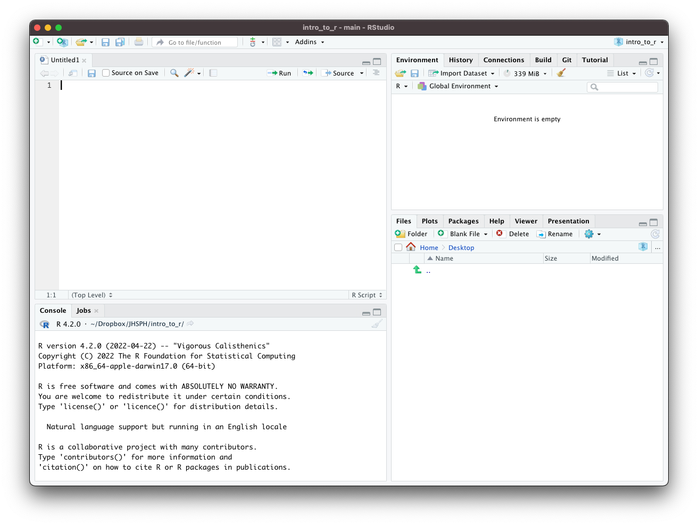

-   [Installing `R`](#installing-r)
-   [Installing `RStudio`](#installing-rstudio)
-   [`R` packages](#r-packages)
    -   [Installing `R` packages](#installing-r-package)
    -   [Exercise: Install `R` package](#exercise-install-r-package)
    -   [Exercise: Install other `R` packages we will use in this course](#exercise-install-other-r-packages-we-will-use-in-this-course)
-   [Install Git](https://git-scm.com/book/en/v2/Getting-Started-Installing-Git)
-   [Set up a GitHub profile](https://github.com/)

`R` is a powerful analytical language and contains a number of useful packages for analyzing data.
`RStudio` is a free and open-source integrated development environment (IDE) for R. `RStudio` provides comprehensive facilities to `R` programmers and is highly recommended in this class.

# Installing `R` {#installing-r}

We recommend installing the most recent version or `R` `r config::get("r_version")`. **If you have had installed `R` already some time ago, we recommend updating/reinstalling it to the most recent version.** Use a link below to launch download of `R` installers (if the download does not start, a fix may be to copy-paste the below link to your browser):

-   [Download For Mac users (M1 chip)](`r config::get("r_dl_mac_m1")`)

-   [Download For Mac users (Intel chip)](`r config::get("r_dl_mac_intel")`)

-   [Download For Windows users](`r config::get("r_dl_windows")`)

For other operating systems, or if you prefer to access the download link from the official website, visit <http://cran.us.r-project.org> and select `Download R for Linux`, `Download R for macOS` or `Download R for Windows` based on which device you have.

Once the proper installation package has been selected, run the package and follow the on-screen directions. This installation includes the `R` language and a graphical user interface (GUI). Rather using the GUI, we recommend installing `RStudio` - an integrated development environment (IDE) that lets you interact with `R` with some added benefits.

# Installing `RStudio` {#installing-rstudio}

To install `RStudio`, visit <https://posit.co/download/rstudio-desktop/>. The website should look like this:

Once on the website, scroll down and select the proper installation file for your platform (Windows, Mac, etc.). Open up the installer and follow the directions to install RStudio. 

**Note** that your operating system may be **too old** to install the current version of RStudio. If this is the case try installing progressively older versions found [here](https://www.rstudio.com/products/rstudio/older-versions/) until it works. You will know if it worked if you try to open RStudio and you see an interface without a message about things going poorly.

When you open up `RStudio`, it should look like this:

Click the top left button to create a new script:

`RStudio`, should now look like this:

There are four main windows.

-   The **console** is the lower-left window where you can run lines of code and see the output.

-   The **script window** is the upper-left window where you can edit and write scripts or markdown documents. From the script window, you can run the current line of code in your script (or multiple lines if you highlight multiple rows) by pressing

    -   `CMD` + `Return` on Mac
    -   `CTRL` + `Enter` on Windows

-   The **workspace** is the upper-right window where you can manage your data and variables and see previous commands entered (under the history tab).

-   The **plots** window allows you to see the output of plots. On the other tabs, you can also look at directories, install packages, and look at help files for various `R` commands.

You can customize the look of your RStudio IDE in `Tools > Global Options...`.

## Troubleshooting the Installation Process

If you run into trouble, check the following:
- did you install the correct version of software for your operating system?
   - Check that you installed the version right for your type of system, (`macOS` vs `Windows` for example)
   - Check if maybe you need a different version for the age of your system. First check that your version of R was right - there are multiple versions for different `macOS` systems for example. You can check the apple icon (top left corner) and "About This Mac" to learn more about the age of your operating system. If your operating system is older (and you can't update it), try installing progressively older versions found [here](https://www.rstudio.com/products/rstudio/older-versions/) until it works. You will know if it worked if you try to open RStudio and you see an interface without a message about things going poorly. Here you can see an [example](https://community.rstudio.com/t/rstudio-desktop-crashes-on-startup-with-library-not-loaded/130296) of this. Unfortunately, the documentation is poor about what older versions work for which operating systems.

# `R` packages {#r-packages}

Packages are the fundamental units of reproducible `R` code. They are collections of `R` code that typically share some common purpose. Examples:

-   `dplyr` - package of functions for fast data set manipulation (subsetting, summarizing, rearranging, and joining together data sets);

-   `ggplot2` - "R's famous package for making beautiful graphics"; allows to build multiple-layers, highly customizable plots.

## Installing `R` package {#installing-r-package}

-   To install an `R` package, type in the `RStudio` console

        install.packages("replace_with_package_name")

    and press enter to execute the command.

-   Once a package is installed, to use its contents in current `R` session, we run in the `RStudio` console the command

        library(replace_with_package_name)

(Note the difference in presence of the quotation mark in the two above commands.)

## Exercise: Install `R` package {#exercise-install-r-package}

Use the above to install `knitr` package. Execute the `library(...)` command to check if the package loads successfully.

